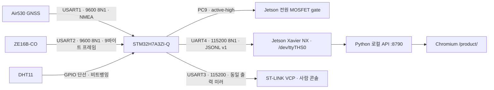

# NUCLEO-H7A3ZI-Q ↔ Jetson Xavier NX 센서 연동

이 문서는 `STM32 상시 센서 허브 → Jetson 로컬 서버 → 7인치 제품 화면`을 실제 하드웨어에 올리는 절차다.
인터넷 연결은 실행에 필요하지 않다.

정본은 다음 세 곳이며, 이 문서는 그 내용을 Jetson 연동 관점에서 정리한 것이다.

| 정본 | 다루는 범위 |
|---|---|
| `OGTECH-embedded/Core/` (`Inc`·`Src`) | 펌웨어가 실제로 하는 일 (핀·보율·문자열·임계값) — 드라이버·통합 계층·프로토콜 모듈 |
| `OGTECH-embedded/README.md` | 구현/미구현 경계와 검증 상태 |
| `MAP/gps_service.py`, `MAP/jetson/` | Jetson 측 파서와 실행 절차 |

> **프로토콜 상태 —** 정본 펌웨어는 UART4에서 **JSONL + CRC16 프로토콜 v1**을 말하고,
> Jetson 파서는 현재 실장된 구 펌웨어의 `$SA1`/`$OGT1` + XOR CSV도 같은 상태 모델로 정규화한다.
> 양쪽 형식은 호스트 계약 테스트로 검증했다. 정본 펌웨어의 CubeIDE 실빌드·플래시는 `[미검증]`이다.
> 프로토콜 세부와 검증 근거는 [6. 프로토콜 현황](#6-프로토콜-현황--jsonl-v1-구현-완료--실장-미검증)에 있다.

## 1. 대상 보드와 빌드 환경

- 보드: **NUCLEO-H7A3ZI-Q (STM32H7A3ZI-Q)** — Nucleo-144 폼팩터
- 빌드: **STM32CubeIDE + HAL**. Arduino IDE/CLI·PlatformIO로는 빌드되지 않는다
  `[출처: OGTECH-embedded/README.md]`
- 저장소에 있는 것: 사용자 코드 `Core/Inc`·`Core/Src` — 드라이버(`air530_gps`·`dht11`·`ze16b_co`·`co_alarm`·`jetson_gate`·`console`), 프로토콜(`telemetry_protocol`), 통합 계층(`sensor_app`), 진입점(`main.c`)
- 저장소에 있는 CubeMX 대조본: `OGTECH-embedded/cubemx/Core/`의 `main.h`, IRQ, MSP(핀·클럭·NVIC)
- 저장소에 **없는 것**: `.ioc`, HAL 드라이버, `.project` 등 완전한 CubeIDE 프로젝트 파일

### CubeIDE 프로젝트 생성 시 주의

1. 보드 선택에서 **`-Q` 접미사가 붙은 디바이스**(STM32H7A3ZI**Q**)를 고른다. `-Q` 없는
   STM32H7A3ZI와는 패키지·SMPS 전원 구성이 다르므로 잘못 고르면 클럭·전원 초기화가 어긋난다.
2. 콘솔용 USART3는 Nucleo-144의 ST-LINK 가상 COM 포트에 연결되어 있다. CubeMX 기본 설정을
   그대로 두면 별도 배선 없이 USB 한 개로 콘솔이 나온다.
3. `Core/Src/main.c`는 CubeIDE가 생성한 `main.c`의 USER CODE 영역에 `SensorApp_Init()`·
   `SensorApp_Process()`·UART 콜백 전달만 얹은 형태다. `main.h`의 심볼
   `DHT11_DATA_Pin` / `DHT11_DATA_GPIO_Port`를 CubeMX의 User Label로 만들어 두어야 컴파일되고,
   `Core/Inc`·`Core/Src`의 모듈 **전부**를 프로젝트 소스에 추가해야 한다.

> **재현성 남은 과제 (팀 과제)** — 제3자가 저장소만으로 빌드할 수 있도록 CubeIDE 프로젝트 전체
> (`.ioc`, HAL 드라이버, 프로젝트 파일)를 커밋해야 한다. `cubemx/Core/`로 핀·IRQ 설정은 기록했지만,
> 현재 코드 기준 빌드 로그(플래시/RAM 사용량)는 아직 없다 `[미검증]`.

## 2. 현재 배선 (실장 부품만)



CO **판정**은 STM32에서 끝난다. Jetson 전원이 꺼져도(`GATE=OFF`) 판정은 계속 돌고 경보는 latched로 남는다.
**경보음은 Jetson 스피커가 낸다**(2026-08-31 부저 PB0 제거) — 그러므로 Jetson이 꺼져 있는 동안은
소리가 나지 않고, 다시 켜져 텔레메트리를 받는 순간 울린다.

### 인터페이스 표

| 인터페이스 | 펌웨어 설정 | 장치 | 핀 확정 여부 |
|---|---|---|---|
| USART1 | 9600 8N1, 1바이트 인터럽트 수신 + 256바이트 링 버퍼 | Air530 GNSS (PB6/PB7, NMEA) | `cubemx/Core/` 대조본 |
| USART2 | 9600 8N1, 1바이트 인터럽트 수신 + 64바이트 링 버퍼 | ZE16B-CO (PD5/PD6, 9바이트 능동 업로드) | `cubemx/Core/` 대조본 |
| **UART4** | 115200 8N1, 송수신 | Jetson 40핀 `/dev/ttyTHS0` (PC10 TX/PC11 RX) | `cubemx/Core/` 대조본 |
| USART3 | 115200 8N1, 송수신 | 사람 콘솔 미러 = ST-LINK VCP (PD8/PD9) | `cubemx/Core/` 대조본 |
| GPIO 단선 | `GPIO_MODE_OUTPUT_OD` ↔ 입력 전환, DWT 마이크로초 지연 비트뱅잉 | DHT11 PA0 (외부 풀업 저항 필요) | `cubemx/Core/Inc/main.h` |
| **PC9** | `GPIO_MODE_OUTPUT_PP`, 초기값 HIGH, active-high | Jetson 전원 MOSFET 게이트 | 코드에 하드코딩 |

PB0·PC9는 드라이버가 직접 초기화하고, UART와 DHT11 핀은 `cubemx/Core/` 대조본에 기록했다.
실제 `.ioc`를 재생성할 때 USART1/2/3/UART4 global interrupt를 전부 Enable해야 한다.

### Air530 GNSS — USART1

| Air530 Grove 선 | 연결 | 비고 |
|---|---|---|
| 빨강 `VCC` | 3.3 V | STM32 로직에 맞춰 3.3 V로 고정. 5 V로 올리지 않음 |
| 검정 `GND` | GND | 공통 접지 |
| 노랑 `TX` | USART1 RX | 필수 |
| 흰색 `RX` | USART1 TX | 설정 명령을 쓸 때만 필요. 현재 펌웨어는 GNSS로 아무것도 보내지 않음 |

펌웨어는 **GGA 문장만** 처리한다. 토커 ID는 가리지 않으므로 `$GNGGA`·`$GPGGA`·`$GLGGA`가 모두
받아들여진다. NMEA 체크섬을 검증하며 **`*` 체크섬 필드가 없는 문장은 거부한다.**
필드 6(fix quality)이 0 이하이면 `GPS=NO_FIX`, 위경도 파싱이 실패해도 fix로 승격하지 않는다.

실내에서는 fix가 늦거나 실패한다. 외장 안테나를 연결하고 하늘이 열린 장소에서 첫 수신을 검증한다.
콜드 부팅 시간은 현장에서 별도 측정한다 `[미검증]`.

### ZE16B-CO — USART2

전원과 UART 로직 전압이 다른 부품이므로 결선 전에 실물 모듈의 정격을 확인한다 `[확인 필요]`.

| ZE16B-CO | 연결 | 비고 |
|---|---|---|
| `Vin` | 모듈 정격 전원 | 역극성 금지 |
| `GND` | GND | STM32와 공통 접지 |
| `TXD` | USART2 RX | 기본 능동 업로드 수신 |
| `RXD` | USART2 TX | 현재 펌웨어는 CO 센서로 아무것도 보내지 않음 |

펌웨어의 프레임 처리는 다음과 같다.

- `0xFF`를 만나면 프레임을 시작하고 9바이트를 모은다.
- `frame[0]=0xFF`, `frame[1]=0x04`, `frame[2]=0x03`을 확인한다.
- 체크섬 = `(~(frame[1]+…+frame[7]) + 1)`이 `frame[8]`과 같아야 한다.
- 농도 = `frame[4] × 256 + frame[5]`.

> `[확인됨]` — 펌웨어는 배율 없이 위 값을 그대로 정수 ppm으로 쓴다. Winsen ZE16B-CO 매뉴얼(v1.1)의 농도식 `High×256+Low`(분해능 1 ppm, 0~500 ppm)과 공식 예제 프레임 검산이 일치한다.
> 소수점 자릿수 바이트(`frame[3]`)도 읽지 않는다. 이전 문서에는 `× 0.1`이 적혀 있었다.
> 구 ZE07-CO의 `×0.1` 배율은 ZE16B-CO에는 적용되지 않는다 — 임계 35/100 ppm은 정수 ppm 기준으로 올바르다.
> 배율을 잘못 적용하면 35 ppm / 100 ppm 임계 판정 전체가 10배 어긋나므로, 실제품에서 CO 센서를 교체할 때는 이 전제를 다시 확인한다.

예열은 **부팅 후 30초**다(`elapsed_ms <= 30000`). 예열 중에는 `CO=WARMING_UP(n s)`로 남은 초를
그대로 표시하고 저농도 값은 판정에 쓰지 않는다. 다만 100 ppm 이상 값이 들어오면 예열 중에도
보수적으로 경보를 울린다 `[추정: 안전 편향]`.

> 제조사는 이 계열 모듈을 인명 안전 시스템에 쓰지 말라고 명시한다. 현재 구성은 대회용 시제품이며
> 인증 CO 경보기의 대체품이 아니다. 교정가스·센서 고장·전원 단선 시험을 완료하기 전에는
> 안전 장치로 간주하지 않는다.

### DHT11 — GPIO 단선

| DHT11 | 연결 | 비고 |
|---|---|---|
| `VCC` | 3.3 V | |
| `GND` | GND | 공통 접지 |
| `DATA` | `DHT11_DATA_Pin` | **외부 풀업 저항 필요** (펌웨어는 `GPIO_NOPULL` + open-drain) |

판독 시퀀스는 `DATA`를 20 ms LOW → 해제 → 30 µs 뒤 입력 전환 → 40비트 수신이다.
판독 중 인터럽트는 막지 않는다. DWT LAR 잠금을 해제해 CYCCNT를 켜고, 카운터가 멈춘 경우에도
HAL tick 2 ms 상한으로 각 대기 루프를 빠져나온다. 5바이트 체크섬이 맞지 않으면 `DHT11=ERROR`다.

### 경보음 — Jetson 스피커 (구 부저 PB0 제거)

2026-08-31부터 보드는 경보음을 내지 않는다. `co_alarm.c`는 판정만 하고, 소리는 텔레메트리를
받은 Jetson이 USB 스피커로 낸다(`Co-LLM/scripts/device_monitor.py` — 경보음 + 음성 안내).
PB0은 더 이상 쓰지 않으므로 다른 용도로 잡아도 된다.

| 담당 | 하는 일 |
|---|---|
| STM32 `co_alarm` | 35/100/30 ppm 판정, latched 유지, 텔레메트리 `level`·`alarm` 송신 |
| Jetson `gps_service`+`co_alarm.py` | `$SA1` CSV에는 경보 필드가 없어 ppm으로 같은 판정을 다시 만든다 |
| Jetson `device_monitor.py` | 경보음(비프) + 음성 안내, 경보가 지속되면 반복 |
| 키오스크 화면 | 경보 배너 표시. 소리는 내지 않는다(데몬과 겹치지 않게) |

### Jetson 전원 MOSFET 게이트 — PC9

| 핀 | 출력 | 동작 |
|---|---|---|
| PC9 | Jetson 전원 게이트 | active-high (`HIGH=공급`, `LOW=차단`). **부팅 시 ON** |

`MX_GPIO_Init`에서 HIGH로 초기화하고 `main()`에서도 `Gate_Set(1)`을 한 번 더 호출한다.
즉 STM32가 리셋되면 Jetson 전원은 항상 켜진 상태에서 시작한다.

PC9에 Jetson 전원을 직접 물리지 말고 정격에 맞는 MOSFET/load-switch·풀업/풀다운·역류 방지
회로를 둔다. 실제 게이트 극성·전원 시퀀스·복귀 동작은 `[미검증]`이다.

## 3. Jetson 링크 프로토콜 (UART4 115200 8N1, USART3 미러)

### 부팅 배너

리셋 직후 아래 3줄이 나온다. 이 배너가 보이면 펌웨어는 살아 있는 것이다.
(배너는 JSON이 아니므로 Jetson 파서는 이 3줄을 거부 카운트하고 지나간다 — 정상이다.)

```text
=== SURVIVAL SENSOR START ===
USART1=Air530 GPS 9600, USART2=ZE16B-CO 9600, UART4=Jetson JSONL 115200, USART3=console mirror 115200
CMD: PING | STATUS | GATE ON/OFF | STREAM ON/OFF | ALERT TRAIL ON/CAUTION/OFF | POWER OFF ACK/CANCEL
```

### 기본 출력 — JSONL 텔레메트리, 2초 주기

부팅 직후부터 `\r\n`으로 끝나는 **JSON 한 줄이 2초마다** 나온다(`TELEMETRY_PERIOD_MS = 2000u`).
DHT11 판독과 텔레메트리 송출이 같은 주기에 묶여 있다. 마지막 필드는 항상
`"crc16"`(CRC-16/CCITT-FALSE, crc16 필드 제외한 base JSON의 ASCII 바이트 대상)이다.

```json
{"v":1,"event":"telemetry","seq":17,"uptime_ms":321000,"gps":{"fix":true,"lat":37.5417940,"lon":127.0795160,"sats":9,"age_s":0.5},"env":{"valid":true,"temp_c":24.3,"humidity_pct":41.0,"age_s":0.1},"co":{"valid":true,"warming_up":false,"level":"normal","alarm":false,"ppm":3,"age_s":0.2},"power":{"valid":false,"jetson_gate_on":true,"shutdown_pending":false},"crc16":"2858"}
```

값을 지어내지 않는 규칙은 필드 생략으로 표현한다.

| 객체 | 정상형 | 값이 없을 때 |
|---|---|---|
| `gps` | `fix:true` + `lat`/`lon`(소수 7자리) + `sats` + `age_s` | `fix:false` — 좌표 필드 자체가 없다. 과거 fix가 있으면 `last_age_s`만 붙는다 |
| `env` | `valid:true` + `temp_c`/`humidity_pct`(DHT11 원시 정수.소수) | `valid:false` — 계측값 필드가 없다 |
| `co` | `valid:true` + `ppm` | `valid:false` — `ppm`이 없다. 단 latched 경보는 `level`/`alarm`으로 유지된다 |
| `power` | 항상 출력. `jetson_gate_on`은 PC9 실상태 | `valid:false` 고정 — 배터리 계측 하드웨어가 없다 |
| `rtc` | (없음) | DS3231 미연결 — 객체 자체를 내보내지 않는다 (파서는 invalid로 정규화) |

`co.level`은 `unknown`(데이터 없음)/`normal`/`warning`(WARN)/`alarm`(ALARM)으로 4절 경보
상태기를 그대로 비춘다. 이벤트 3종(`telemetry`/`output`/`power`)의 정본 스키마는
`MAP/gps_service.py`의 파서이고, 펌웨어 쪽 구현은 `OGTECH-embedded/Core/Src/telemetry_protocol.c`다.

### 명령

UART4 또는 USART3로 수신하며 `\r` 또는 `\n`으로 종결한다. `strcmp` **완전 일치**이므로 대소문자와 공백이
정확해야 하고, 앞뒤 공백이나 소문자는 통하지 않는다. 한 줄은 63자까지이며 넘치면 개행까지 통째로
버리고 `ERR LINE_TOO_LONG`으로 답한다.

| 명령 | 응답 | 동작 |
|---|---|---|
| `PING` | `PONG` | 생존 확인 (사람용) |
| `STATUS` | 사람이 읽는 상태 한 줄 | `DHT11=OK,TEMP=…,ALARM=…,GATE=…` 형식. 시연 콘솔용 |
| `GATE ON` / `GATE OFF` | `ACK GATE=…` + `event:"power"` JSONL | PC9 게이트 전환. 사람용 ACK와 Jetson용 이벤트를 모두 낸다 |
| `STREAM ON` | 즉시 텔레메트리 1줄 | Jetson `GpsService`가 접속 직후 보낸다. 텍스트 ACK 없음(파서 오염 방지) |
| `STREAM OFF` | `ACK STREAM=OFF` | 주기 스트림 정지 — TeraTerm으로 조용히 보고 싶을 때 |
| `ALERT TRAIL ON/CAUTION/OFF` | `event:"output"` JSONL ACK | 트레일 출력 상태 전이. 30초 무갱신 시 watchdog이 자동 off + 통지 |
| `POWER OFF ACK` / `POWER OFF CANCEL` | `event:"power"` `state:"status"` JSONL | 전원 버튼 미구현 → 종료 대기 상태가 없으므로 현재 상태만 보고 |
| 그 외 | `ERR UNKNOWN_CMD` | |

주기 스트림은 **부팅 기본 ON**이다. Jetson의 `STREAM ON`이 유실돼도 텔레메트리는 계속 나온다.
사람 콘솔(TeraTerm)로 시연할 때는 `STREAM OFF` 후 `STATUS`를 쓰면 읽기 편하다.

`GATE OFF` → CO 노출 → `GATE ON` 직후 스피커 경보 확인이 "Jetson이 꺼져 있어도 CO를 감시한다"는
이 작품의 핵심 주장을 시연하는 최소 절차다(경보는 latched라 켜진 뒤에도 살아 있다). 꺼져 있는
동안 소리로 확인할 방법은 없다 — 부저를 걷어낸 대가다.

## 4. CO 경보 규칙

구현 완료(2026-08-20). **빌드·실장 검증은 `[미검증]`이다.**

| 판정 | 조건 (코드값) | 스피커 (Jetson) |
|---|---|---|
| ALARM | `co_ppm >= 100` 즉시. 예열 중에도 적용 | 경보음 3연타 + "일산화탄소 경보입니다…", 20초마다 반복 |
| WARN | `co_ppm >= 35`이 **180000 ms(3분)** 연속 지속 | 주의음 2연타 + "일산화탄소 주의…", 60초마다 반복 |
| 해제 | `co_ppm < 30`이 **30000 ms(30초)** 연속 지속 | 정지 |

판정에 쓰는 세부 규칙:

- **신선도** — `co_valid`이고 마지막 유효 프레임이 3초 이내일 때만 판정한다.
- **센서가 끊겨도 래치를 풀지 않는다.** 프레임이 끊기면 지속 시간 추적만 초기화하고
  이미 올라간 `ALARM`/`WARN`은 유지한다.
- **예열 중 저농도는 무시한다.** 부팅 후 30초 동안은 100 ppm 즉시 경보만 살아 있다.
- **WARN은 ALARM을 덮지 않는다.** `WARN` 승격은 현재 상태가 `NONE`일 때만 일어나므로,
  한 번 `ALARM`이 되면 30 ppm 미만 30초 해제 조건을 통과하기 전까지 내려가지 않는다.
- 판정은 `HAL_GetTick()` 기반 논블로킹이라 경보 중에도 GPS·CO 수신과 명령 처리가 계속된다.

`GATE=OFF` 상태에서도 판정은 STM32에서 그대로 동작한다(소리는 Jetson이 켜져야 난다). 이것이 이
구조의 존재 이유이며, **Jetson 전원 OFF 상태 연속 20회 경보 시험**은 아직 남아 있다 `[미검증]`.

## 5. Jetson 연결과 실행

> **실제 배치 (2026-08-30 확인 · Jetson Xavier NX devkit, L4T R35.6.5)** — 보드는 40핀 UART
> **`/dev/ttyTHS0`(serial@3100000)** 에 물려 있다. 현재 플래시된 구 펌웨어는 `$SA1,…*XOR` CSV(1 Hz)를
> 보내고, 다음 플래시 대상 정본 `Core/`는 같은 배선으로 JSONL v1(2초)을 보낸다. `gps_service.py`가 두 형식을
> 모두 검증·정규화하므로 **같은 `app.py --gps-mode stm32`와 새 `/product/` UI**를 사용한다. 구 8791
> `kiosk/uart_server.py`는 복구·비교용 진단 도구일 뿐 운영 경로가 아니다.
>
> **필수 사전 조치(한 번):** `sudo systemctl disable --now nvgetty` · `sudo usermod -aG dialout kit`.
> JetPack 기본 `nvgetty.service`는 부팅 시 ttyTHS0에 `getty -L 115200`을 띄워 STM32 프레임을 로그인 입력으로 소비하고
> 프롬프트·에코를 STM32로 되보낸다. 2026-08-30 이 때문에 STM32가 송출을 멈춰 브리지가 24분간 0프레임(UART 오버런 70,349회)이었고
> 리셋 후 복구됐다. 비활성화 뒤 재부팅에서는 리셋 없이 즉시 수신(저널 getty 0건, 오류 카운터 0).

### 5.1 물리 연결 — Jetson 40핀 UART

1. STM32 PC10(UART4 TX) → Jetson pin 10(RX), STM32 PC11(UART4 RX) ← Jetson pin 8(TX), GND를 공통 연결한다.
2. 두 보드 모두 **3.3 V TTL**만 사용한다. 5 V UART나 전원 VCC를 신호 핀에 연결하지 않는다.
3. 최초 한 번 `sudo systemctl disable --now nvgetty`를 실행하고 `kit` 사용자를 `dialout`에 넣은 뒤 재로그인한다.
4. `ls -l /dev/ttyTHS0`이 `root dialout`이고 `systemctl is-active nvgetty`가 `inactive`인지 확인한다.

USART3/ST-LINK VCP는 사람 콘솔 미러이므로 필요하면 개발 PC에 연결한다. Jetson 운영 입력은 UART4다.

### 5.2 먼저 사람 눈으로 확인

Jetson 서비스를 올리기 전에 시리얼 터미널로 **부팅 배너 3줄과 2초 주기 JSONL 줄**을 직접 본다.
여기서 아무것도 안 나오면 아래 절차는 전부 무의미하다.

```bash
sudo apt-get install -y python3-serial     # 없으면
python3 -m serial.tools.miniterm /dev/ttyTHS0 115200
```

`PING` → `PONG`, `GATE OFF` → `ACK GATE=OFF` 왕복을 확인한다. JSONL이 눈에 거슬리면
`STREAM OFF`로 멈추고 `STATUS`로 사람용 상태 줄을 본다(확인이 끝나면 `STREAM ON`으로 되돌린다 —
Jetson 서비스도 접속하며 `STREAM ON`을 보내므로 잊어도 복구된다).

### 5.3 파일 설치

Jetson으로 옮겨야 하는 폴더는 세 개다.

```text
OGTECH-frontend/                → /home/kit/ogtech/OGTECH-frontend
OGTECH-llm/                     → /home/kit/ogtech/OGTECH-llm
OGTECH-embedded/Core/           → 재플래시·참조용
```

```bash
cd /home/kit/ogtech/OGTECH-frontend/MAP
python3 -m venv .venv
. .venv/bin/activate
python -m pip install --no-index --find-links wheels -r requirements.txt
chmod +x jetson/start-map.sh jetson/start-kiosk.sh

cd /home/kit/ogtech/OGTECH-llm/Co-LLM
python3 -m venv .venv
. .venv/bin/activate
chmod +x scripts/07_product_voice.sh scripts/08_device_monitor.sh scripts/09_physical_voice.sh
```

`wheels/`는 인터넷이 되는 같은 아키텍처 환경에서 미리 준비해야 한다. 네트워크 설치를 허용하는 초기
준비 단계라면 `python -m pip install -r requirements.txt`를 사용할 수 있다.

한국 시연에서는 시스템 시간대를 먼저 맞춘다.

```bash
sudo timedatectl set-timezone Asia/Seoul
timedatectl
```

일출·일몰은 GPS 좌표와 로컬 날짜·시간으로 계산한다. GPS만으로 정치적 시간대 경계를 확정할 수 없으므로,
다른 지역으로 이동할 때는 시스템 시간대 또는 `OGTECH_UTC_OFFSET_MIN`을 현지 값으로 바꿔야 한다.

### 5.4 환경변수

`jetson/map.env.example`가 정본이다 `[출처: MAP/jetson/map.env.example]`.

| 변수 | 기본값 | 뜻 |
|---|---|---|
| `OGTECH_STM32_PORT` | `/dev/ttyTHS0` | Xavier NX devkit 40핀 UART |
| `OGTECH_STM32_BAUD` | `115200` | 펌웨어 UART4 보율과 일치해야 한다 |
| `OGTECH_UTC_OFFSET_MIN` | `540` | 한국 고정 시연값 |
| `OGTECH_TRAIL_THRESHOLD_M` | `30` | 트레일 이탈 임계 `[추정: 현장 실측 전 기본값]` |
| `OGTECH_RETURN_SPEED_MPS` | `0.8` | 보행 속도 `[추정]` |
| `OGTECH_RETURN_MARGIN_MIN` | `30` | 귀환 안전 여유 `[추정]` |

### 5.5 수동 실행

```bash
cd /home/kit/ogtech/OGTECH-frontend/MAP
export OGTECH_STM32_PORT=/dev/ttyTHS0
export OGTECH_UTC_OFFSET_MIN=540
./jetson/start-map.sh
```

`start-map.sh`는 `app.py`를 `--host 127.0.0.1 --port 8790 --gps-mode stm32`로 띄운다.
다른 터미널에서 상태를 확인한다.

```bash
curl -s http://127.0.0.1:8790/api/health
curl -s http://127.0.0.1:8790/api/device | python3 -m json.tool
```

화면:

```text
http://127.0.0.1:8790/select/        ★ 화면 선택 (키오스크가 부팅 때 여는 화면)
http://127.0.0.1:8790/video/?live=1  정본 제품 화면 (1024×600)
http://127.0.0.1:8790/product/       구 제품 화면 (지도 엔진·음성·웨이포인트 연동)
http://127.0.0.1:8790/               개발자 지도 변환 도구
```

키오스크 실행:

```bash
./jetson/start-kiosk.sh
```

`start-kiosk.sh`는 `/select/` 응답을 최대 60초 기다린 뒤 브라우저를 띄운다. 선택 화면에서 제품 화면과
촬영 화면을 터치로 고른다. 특정 화면으로 바로 띄우려면 `OGTECH_KIOSK_URL`을 쓰고, 촬영용 자동
재생은 `/video/?live=1&autoplay=1`·`&autoplay=loop`. Firefox가 있으면
전용 프로필 `~/.config/ogtech/firefox-kiosk`(`OGTECH_FIREFOX_PROFILE`로 변경)에 `user.js`를 써서
정전 뒤 세션 복구·안전 모드·첫 실행 안내가 제품 화면을 가리지 않게 하고, `--kiosk --no-remote`로 실행한다.
Chromium 폴백의 `--autoplay-policy=no-user-gesture-required`는 화면 문구를 읽어 주는 음성을 위해 사용한다
`[출처: jetson/start-kiosk.sh]`. CO 경보음은 브라우저가 아니라 `device_monitor.py`가 낸다.

### 5.6 저하 부팅 — 직렬 포트가 없어도 죽지 않는다

`jetson/start-map.sh`는 STM32 직렬 포트가 부팅 시 아직 없어도 경고만 찍고 서버를 계속 띄운다.
`GpsService`는 2초 간격(`SERIAL_RECONNECT_AFTER_S = 2.0`)으로 해당 포트 연결을 재시도한다.
그동안 `/product/`는 GPS fix·센서를 회색 대기 상태로 표시하며 위치를 추정하지 않는다.
센서 입력이 3초(`SENSOR_STALE_AFTER_S = 3.0`) 넘게 멈추면 live 상태를 해제한다.

이 저하 부팅은 센서 없이 정상이라고 판정하는 기능이 아니다. `/api/device`에서 `gps.connected=false`,
`gps.fix=false`와 오류 원인을 확인하고, 실제 인수에서는 직렬 포트 연결 뒤 live 센서·GPS 상태가 전이된
증거를 별도로 기록한다.

### 5.7 systemd 자동 시작

예시 파일은 `MAP/jetson/`과 `Co-LLM/jetson/`에 있으며 실기 사용자 `kit`과 `/home/kit/ogtech` 경로를 쓴다.
순서는 MAP API를 먼저 준비하고, 그 API에 의존하는 전원·물리 음성·선제
음성 서비스를 올린 뒤 키오스크를 마지막에 시작한다.

```bash
sudo install -d /etc/ogtech
sudo install -m 0644 jetson/map.env.example /etc/ogtech/map.env
sudo install -m 0644 /home/kit/ogtech/OGTECH-llm/Co-LLM/jetson/audio.env.example /etc/ogtech/audio.env
sudo install -m 0644 jetson/ogtech-map.service /etc/systemd/system/
sudo install -m 0644 jetson/ogtech-power-manager.service /etc/systemd/system/
sudo install -m 0644 /home/kit/ogtech/OGTECH-llm/Co-LLM/jetson/ogtech-physical-voice.service /etc/systemd/system/
sudo install -m 0644 /home/kit/ogtech/OGTECH-llm/Co-LLM/jetson/ogtech-device-monitor.service /etc/systemd/system/
sudo install -m 0644 jetson/ogtech-kiosk.service /etc/systemd/system/
sudo systemctl daemon-reload
sudo systemctl enable --now ogtech-map.service
sudo systemctl enable --now ogtech-power-manager.service
sudo systemctl enable --now ogtech-physical-voice.service
sudo systemctl enable --now ogtech-device-monitor.service
sudo systemctl enable --now ogtech-kiosk.service
```

`sudo` 설치 권한이 없는 실기 사용자 환경에서는 저장소의 `jetson/user/*.service`를 사용자 유닛으로 쓴다.
`kit`은 이미 `dialout` 그룹이어야 하며, 전원 종료 매니저는 root 권한이 필요하므로 이 경로에서 활성화하지 않는다.
실기(2026-08-30)는 이 사용자 유닛 경로로 배포돼 있다.

```bash
mkdir -p ~/.config/ogtech ~/.config/systemd/user
cp jetson/map.env.example ~/.config/ogtech/map.env
cp jetson/user/ogtech-map.service jetson/user/ogtech-kiosk.service ~/.config/systemd/user/
systemctl --user daemon-reload
systemctl --user enable --now ogtech-map.service ogtech-kiosk.service
sudo loginctl enable-linger kit   # 로그인 전에도 사용자 매니저를 띄워 MAP/LLM을 먼저 준비(선택, 1회)
```

부팅 시 자동 표시 조건:

- GDM 자동 로그인(`/etc/gdm3/custom.conf`의 `AutomaticLoginEnable=true`, `AutomaticLogin=kit`, `WaylandEnable=false`)이
  켜져 있어야 X 세션과 `graphical-session.target`이 올라온다.
- `ogtech-map.service`는 `WantedBy=default.target`이며 `After=default.target`을 쓰지 않는다. 그 조합은 systemd가
  순서 순환으로 판정해 부팅 시 잡을 삭제한다(실기에서 map/kiosk가 inactive로 남은 원인).
- `ogtech-kiosk.service`는 `WantedBy=graphical-session.target` + `PartOf=graphical-session.target`이다. GNOME 세션이
  `DISPLAY`/`XAUTHORITY`를 사용자 매니저에 반입한 뒤에 시작되므로 별도의 `Environment=DISPLAY`가 필요 없다.
- 확인은 실제 재부팅 뒤 `systemctl --user is-active ogtech-map.service ogtech-kiosk.service`와 화면 캡처로 한다.
  `systemctl --user start`로 되는 것과 부팅 자동 기동은 다르다.

로그:

```bash
journalctl -u ogtech-map.service -f
journalctl -u ogtech-power-manager.service -f
journalctl -u ogtech-physical-voice.service -f
journalctl -u ogtech-device-monitor.service -f
journalctl -u ogtech-kiosk.service -f
```

> `ogtech-power-manager.service`는 물리 전원 버튼 종료 handshake용이다. 현재 펌웨어에는
> 버튼과 handshake가 없으므로(7절 참조) 이 서비스는 아직 할 일이 없다. 서비스를 올려도
> 무해하지만, 동작을 시연 항목에 넣지 않는다.

## 6. 프로토콜 현황 — 정본 JSONL v1 + 실장 CSV 호환

정본은 JSONL+CRC16 v1이다. 다만 현재 보드에는 출처가 남지 않은 `$SA1`+XOR CSV 펌웨어가
플래시되어 있어, 재플래시 전에도 새 제품 UI를 쓸 수 있도록 Jetson 파서에 제한된 호환 입력을 둔다.

| 계층 | 형식 |
|---|---|
| 정본 펌웨어 UART4 출력 | **JSONL + 끝 필드 `"crc16":"XXXX"`** (CRC-16/CCITT-FALSE) — 3절 참조 |
| 현재 실장 구 펌웨어 | `$SA1,…*XX` (XOR, 1 Hz), 명령 채널·RTC·전원·경보 레벨 없음 |
| Jetson 파서 입력 | `parse_stm32_telemetry`(정본) + `parse_stm32_ogt1`(`$SA1`/`$OGT1` 호환) |

명령 방향도 맞췄다. `GpsService`가 보내는 `STREAM ON`, `ALERT TRAIL ON/CAUTION/OFF`,
`POWER OFF ACK/CANCEL`을 펌웨어가 전부 처리한다(3절 명령 표). `event:"button"`은 물리 버튼이
없어 아직 내보내지 않는다(7절 설계 목표).

### 검증 근거 — 무엇으로 "말이 통한다"고 하는가

`OGTECH-embedded/tests/`의 호스트 테스트가 **양쪽 실물 코드**를 맞물린다.

1. `tests/host/test_protocol.c` — CRC 표준 벡터(`"123456789"` → `0x29B1`)와 이벤트 3종 골든 JSON.
2. `tests/host/test_firmware_sim.c` — mock HAL 위에서 `Core/Src` 전체(드라이버·통합 계층·`main.c`)를 **그대로 컴파일**해
   명령 링버퍼 → 응답 경로를 구동(과길이 폐기·watchdog·gate 전이 포함).
3. `tests/test_protocol_contract.py` — 시뮬레이터가 낸 UART4 출력을 이 저장소의
   `gps_service.py` 파서에 그대로 먹여 왕복 검증(값 정규화·seq 연속성·CRC 동치·오염 바이트 거부).

### 남은 것 — 실물 연동 `[미검증]`

호스트 검증은 형식 계약까지다. 다음은 하드웨어가 있어야 한다.

- CubeIDE 프로젝트에 `telemetry_protocol.c/.h`를 추가한 **실빌드**와 플래시 (1절 주의사항 참조)
- 정본 펌웨어를 실보드에 플래시한 뒤 UART4 ↔ Jetson으로 `/api/device`에 실제 센서 값이 채워지는지
- 115200 보율에서 2초 주기 ~400바이트 텔레메트리의 장시간 안정성

> 실물 연동 전까지 `/product/`가 센서 값을 보여준다면 replay 모드이거나 샘플 데이터이며,
> 화면에 `모의 데이터` 태그가 남아 있어야 정상이다.

## 7. 설계 목표 (미구현 — 현재 코드에 없다)

아래는 전부 **목표 사양**이다. 이전 문서에 확정 사실처럼 적혀 있던 내용을 이 절로 내렸다.
있는 것처럼 발표하거나 시연 항목에 넣지 않는다.

### 7.1 목표 하드웨어 (미연결)

| 부품 | 목표 인터페이스 | 상태 |
|---|---|---|
| BMP390 기압 | I2C1, `0x77` 우선 · `0x76` 차순 | **미연결** |
| DS3231 RTC | I2C1, `0x68`, OSF(status `0x0F` bit 7) 확인 후 UTC | **미연결** |
| 물리 버튼 3개 (전원 / 체크포인트 / 음성) | active-low + internal pull-up, 40 ms debounce | **미구현** |
| 진동 모터 | GPIO + MOSFET + 역기전력 다이오드 | **미구현** |
| 스트로브 | GPIO + 부하 전류에 맞는 MOSFET | **미구현** |

SHT40(I2C `0x44`, 명령 `0xFD`, CRC-8 poly `0x31`/init `0xFF`)은 **DHT11로 대체**되어 목표에서
빠졌다. ZE07-CO도 **ZE16B-CO로 교체**되었다. 프런트엔드 코드의 `env.sht_valid`·`co` 필드 이름은
여전히 옛 부품 이름을 쓰지만, 실제 데이터 출처는 DHT11과 ZE16B-CO다.

### 7.2 목표 텔레메트리 전체 스키마 (JSONL + CRC16)

**골격(JSONL+CRC16, gps/env/co/power)은 3절대로 구현되어 있다.** 이 절은 목표 하드웨어가
전부 붙었을 때 채워질 전체 스키마다 — 현재 펌웨어와의 차이는 `rtc` 객체,
`env`의 기압 필드(`press_hpa`/`press_trend`/`press_age_s`/`bmp_address`),
`gps`의 `acc_m`/`hdop`, `power`의 배터리 계측(`percent`/`days_left`, `valid:true`)이다.
없는 하드웨어의 필드는 지금은 생략되며, 파서가 invalid/None으로 정규화한다.

```json
{"v":1,"event":"telemetry","seq":123,"uptime_ms":456000,"gps":{"fix":true,"lat":37.5435,"lon":127.0767,"acc_m":null,"hdop":0.9,"sats":11,"age_s":0.2},"rtc":{"valid":true,"iso_utc":"2026-08-19T00:00:00Z","age_s":0.1},"env":{"valid":true,"sht_valid":true,"pressure_valid":true,"temp_c":23.45,"humidity_pct":58.20,"press_hpa":1007.4,"press_trend":"falling","age_s":0.1,"press_age_s":0.1,"bmp_address":119},"co":{"valid":true,"warming_up":false,"ppm":3.2,"level":"normal","alarm":false,"age_s":0.1},"power":{"valid":false,"percent":null,"days_left":null,"jetson_gate_on":true,"shutdown_pending":false},"crc16":"ABCD"}
```

- `crc16`은 **마지막 필드**여야 하며, 앞부분 JSON 문자열의 CRC-16/CCITT-FALSE다.
  Jetson은 맞지 않는 줄을 버린다 `[출처: gps_service.py]`.
- `press_trend`는 `rising`/`steady`/`falling`/`unknown`만 허용한다. 1분 간격 표본이 10분 이상
  쌓인 뒤에만 최소제곱 기울기로 판정하고 그 전에는 `unknown`이다.
- `pressure_valid=false`면 `press_hpa=null`, 추세는 `unknown`으로 유지한다.
- `rtc.valid=false`면 `iso_utc=null`이며, Jetson 시스템 시간이나 추정 시각으로 덮지 않는다.

### 7.3 목표 명령 집합 (잔여분)

Jetson이 실제로 보내는 명령(`STREAM ON`, `ALERT TRAIL ON/CAUTION/OFF`,
`POWER OFF ACK/CANCEL`)과 `STREAM OFF`는 **구현되었다** — 정본은 3절 명령 표.
아래만 목표로 남아 있다.

```text
GET_TELEMETRY        ← 폴링형 1회 요청 (현재는 주기 스트림만)
GET_FIX
POWER STATUS
SET RTC UTC YYYY-MM-DDTHH:MM:SSZ   ← DS3231 연결 후
```

`SET RTC UTC`는 정비자가 **직렬 콘솔에서만** 쓰는 명령으로 설계했다. 형식과 달력 범위를 검증한
뒤에만 DS3231에 기록하고 OSF를 해제하며, MAP·LLM HTTP API로는 노출하지 않는다.

### 7.4 목표 전원 버튼 handshake

`jetson/power_control.py`와 `ogtech-power-manager.service`는 이 절차를 전제로 작성되어 있다.
펌웨어 쪽 버튼이 없으므로 아직 성립하지 않는다 — 현재 펌웨어는 `POWER OFF ACK/CANCEL`을 받으면
종료 대기 상태가 없다는 사실을 `event:"power"` `state:"status"`로 정직하게 보고할 뿐이다.

1. 게이트가 켜진 상태에서 전원 버튼을 2초 이상 길게 누른 뒤 놓으면 STM32가 `shutdown_requested`를 보낸다.
2. `ogtech-power-manager`가 CRC로 검증된 pending을 확인하고 `/api/power/shutdown-ack`로
   `POWER OFF ACK`를 큐잉한다.
3. STM32가 ACK를 받으면 `shutdown_ack`를 내보내고 **90초 뒤** PC9 게이트를 끈다.
4. ACK 확인 뒤 서비스가 `systemctl poweroff --no-block`을 요청한다. 실패하면
   `/api/power/shutdown-cancel` → `POWER OFF CANCEL`로 예약을 취소하고 `shutdown_cancelled`를 확인한다.
5. ACK가 없으면 **120초 뒤** `shutdown_timeout`을 내보내고 pending을 취소하며 게이트를 유지한다.
6. 게이트가 꺼진 상태에서 전원 버튼을 놓으면 STM32가 게이트를 다시 켠다.

이 절차는 ACK 수신과 예정된 게이트 동작을 전달할 뿐, Jetson이 실제로 완전히 종료됐다는 사실을
보장하지 않는다.

### 7.5 목표 CO 경보 곡선 (확장)

현재 구현은 4절의 3줄(35 ppm/3분, 100 ppm 즉시, 30 ppm 미만 30초 해제)이 전부다.
아래 항목은 아직 코드에 없다.

- 최근 10분 최저값 대비 **+20 ppm 급상승** 시 주의 `[추정: 프로젝트 안전 기준]`
- 다단 지속 곡선: 70 ppm/60분, 150 ppm/10분, 400 ppm/4분 `[출처: 프로젝트 고정 기준 — UL2034 계열]`
- 저온 경보 (DHT11 온도 기반)

## 8. 문제 해결

| 증상 | 확인 순서 |
|---|---|
| 터미널에 아무것도 안 나온다 | 보율 115200 → `/dev/ttyTHS0` 권한 → `nvgetty` inactive → PC10/PC11 TX/RX 교차 → GND 공통 순으로 확인 |
| 서버는 뜨는데 `/product/`가 계속 회색 | `/api/gps`의 `received_lines`·`rejected_lines`·`error`를 본다. `$SA1`/`$OGT1`/JSONL v1은 모두 수용하므로 둘 다 안 늘면 포트·보율·배선 문제다 |
| `curl /api/device`에 `connected=false` | `start-map.sh`가 경고를 찍고 저하 부팅했는지 로그 확인 → 케이블 재연결 후 2초 재시도 루프가 복구하는지 |
| `CO=NOT_FOUND`가 사라지지 않는다 | ZE16B-CO 전원 정격 → TX/RX가 뒤바뀌지 않았는지 → 보율 9600 → 프레임 헤더 `FF 04 03`이 맞는지 |
| `CO=WARMING_UP`이 안 끝난다 | 30초 예열이다. 남은 초가 줄어들지 않으면 STM32가 계속 리셋되고 있는지 확인 |
| 40핀 UART가 계속 수신 대기 | `journalctl -b \| grep -iE "ttyTHS0\|login\["`에 getty/login 흔적이 있으면 `nvgetty`가 포트를 건드린 것 — `sudo systemctl disable --now nvgetty` 후 STM32 리셋. 바이트 도착 여부는 `/proc/interrupts`로 보지 말고 `TIOCGICOUNT`의 rx/overrun/brk로 본다 |
| `Permission denied: /dev/ttyTHS0` | `ls -l /dev/ttyTHS0`이 `root tty 620`이면 getty 흔적. nvgetty 비활성화 + 재부팅 후 `root dialout 660`이 되므로 실행 사용자를 `dialout`에 넣는다 |
| `GPS=NOT_FOUND`가 계속된다 | NMEA가 5초 이상 없다는 뜻이다. 안테나·야외 이동 → TX/RX 방향 → 보율 9600 |
| `GPS=NO_FIX`에서 안 올라간다 | NMEA는 들어오는데 fix가 없는 상태다. `SAT` 수를 보며 하늘이 열린 곳에서 대기 |
| `DHT11=ERROR`가 반복된다 | 데이터 선 **외부 풀업 저항**이 있는지(펌웨어는 내부 풀업을 쓰지 않는다) → 배선 길이 → 3.3 V 전원 |
| CO 경보음이 안 난다 | 화면에 경보 배너가 떴는지(안 떴으면 판정 문제) → `systemctl --user status ogtech-device-monitor` → `journalctl --user -u ogtech-device-monitor -f`에 `알림 재생 실패`가 있는지 → `aplay -D "$OGTECH_SPK_DEVICE" ...`로 장치 직접 확인. 부저는 2026-08-31 제거했다 |
| `GATE OFF`를 보내도 Jetson이 안 꺼진다 | `ACK GATE=OFF`가 왔는지 → PC9 MOSFET 게이트 회로 극성 → 명령 대소문자와 공백(`GATE OFF` 완전 일치) |
| 명령이 `ERR UNKNOWN_CMD`로 돌아온다 | 대소문자·공백 확인(완전 일치). 아는 명령은 3절 명령 표의 11개가 전부다 |
| 터미널이 JSON으로 가득해 읽기 어렵다 | 정상이다(기본 스트림 ON). `STREAM OFF` 후 `STATUS`로 사람용 상태 줄을 본다 |

## 9. 실장 검증 체크리스트

현재 실장 부품 기준이다. 미구현 항목은 7절에 있고 체크리스트에 넣지 않는다.

- [ ] CubeIDE 프로젝트(`.ioc`, `main.h`; `Core/Inc`·`Core/Src` 모듈 전부 포함) 커밋 후 클린 빌드 성공, 플래시/RAM 사용량 기록
- [ ] 부팅 배너 3줄 확인
- [ ] 2초 주기 JSONL 텔레메트리가 끊기지 않고 이어지는지 (10분 연속, `seq` 결번 없음)
- [ ] `PING` → `PONG` 왕복 · `STREAM OFF` → `STATUS` 사람용 줄 → `STREAM ON` 복귀
- [ ] DHT11 온습도를 기준 계측기와 비교
- [ ] 데이터 선을 뽑았을 때 `DHT11=ERROR`로 전환
- [ ] ZE16B-CO 30초 예열 카운트다운이 실제로 줄어드는지
- [x] **ZE16B-CO ppm 배율** — 데이터시트 확인 완료: 배율 없음(정수 ppm), 임계 판정 전제 유효
- [ ] CO 케이블을 뽑았을 때 3초 뒤 `CO=NOT_FOUND`로 전환
- [ ] 인증 교정가스로 WARN(35 ppm/3분)·ALARM(100 ppm 즉시)·해제(30 ppm 미만/30초) 시험
- [ ] 경보 중 CO 케이블을 뽑아도 래치가 풀리지 않는지
- [ ] Air530 NMEA 체크섬 정상, 야외 cold fix 시간 기록
- [ ] 실내에서 `GPS=NOT_FOUND` / `GPS=NO_FIX`가 정직하게 나오는지
- [ ] `GATE OFF` → `ACK GATE=OFF` → Jetson 전원 차단 → `GATE ON`으로 복귀
- [ ] **Jetson 전원을 끈 상태(`GATE=OFF`)에서 CO 경보 연속 20회**
- [x] 현재 `$SA1` 실장본에서 `/api/device`에 GPS·DHT11·ZE16B 값이 채워지고 `telemetry_protocol=ogt1`인지 (2026-08-30 Jetson 확인)
- [ ] 정본 JSONL v1 펌웨어 플래시 뒤 `telemetry_protocol=v1`, 명령 왕복, `rejected_lines` 무증가 확인
- [ ] `ALERT TRAIL ON` → `event:"output"` ACK 수신, 30초 방치 시 watchdog 자동 off 통지
- [ ] 직렬 케이블 분리 후 화면이 3초 안에 회색/연결 끊김으로 전환
- [ ] 케이블 재연결 후 2초 재연결 루프가 자동 복구
- [ ] STM32 포트 없이 저하 부팅한 뒤 `/api/device`의 `connected=false` 확인
- [ ] 네트워크 케이블을 뽑고 20회 연속 부팅·시연

## 제조사 자료

- [Seeed Grove GPS Air530 문서](https://wiki.seeedstudio.com/Grove-GPS-Air530/)
- [Winsen 센서 자료실](https://www.winsen-sensor.com/) — ZE16B-CO 데이터시트 `[확인 필요: 직접 링크 미확보]`
- [NVIDIA Jetson Xavier NX 시작 문서](https://developer.nvidia.com/embedded/learn/get-started-jetson-xavier-nx-devkit)
