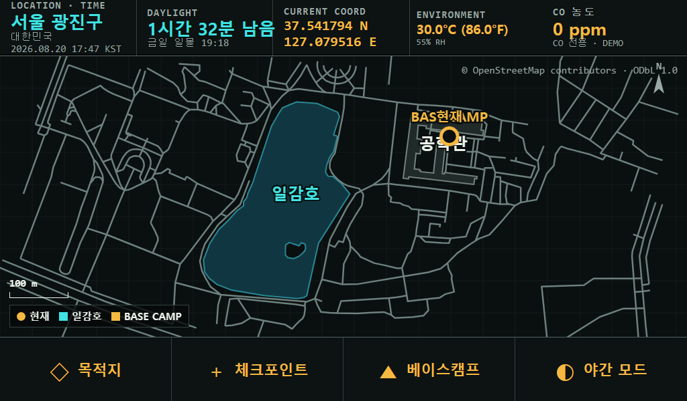
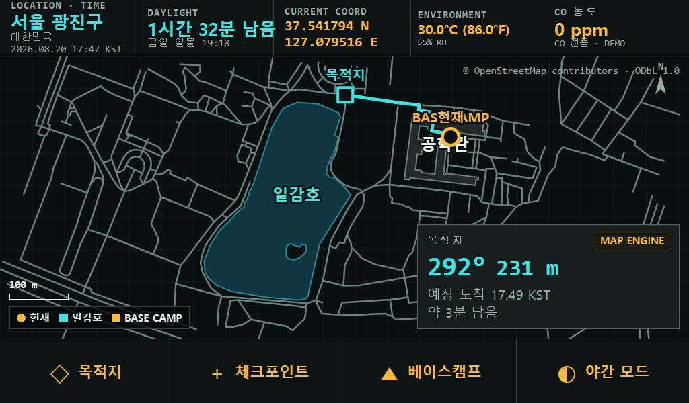
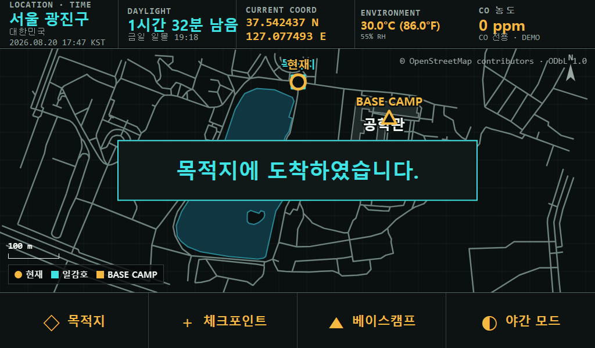
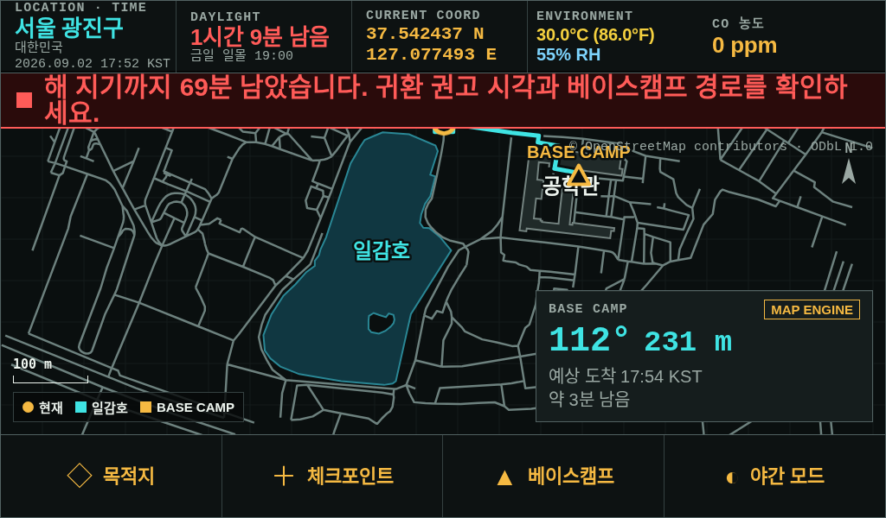
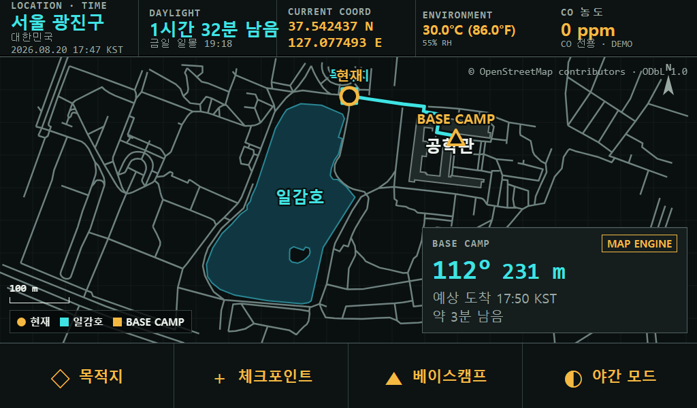
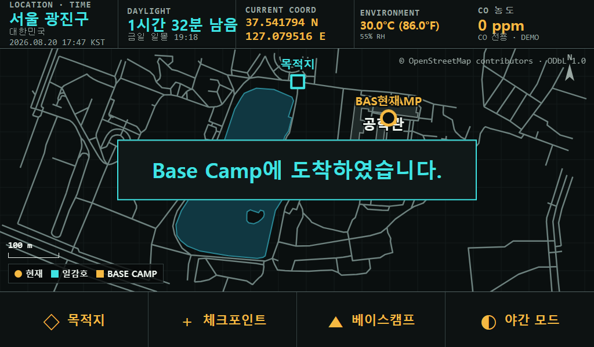
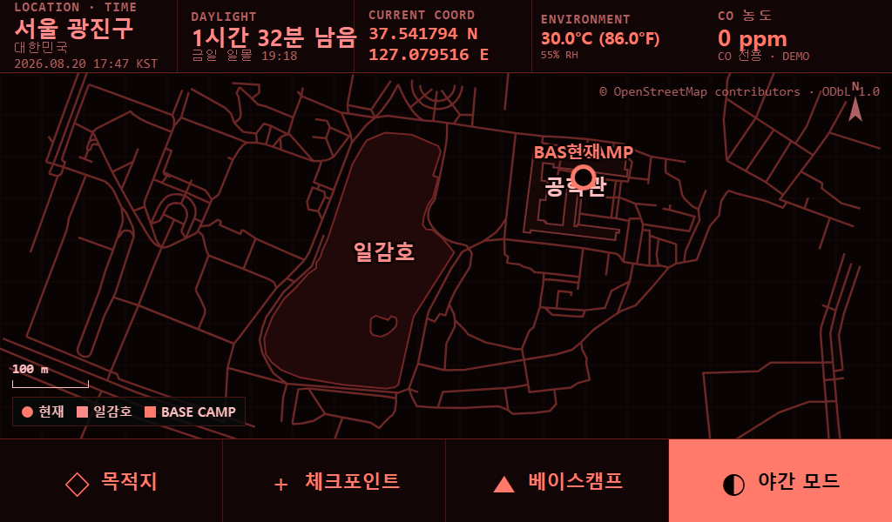

# OGTECH-frontend — 키오스크 UI와 오프라인 지도 엔진

**OGTECH Kit** (2026 임베디드 소프트웨어 경진대회 자유공모 / 팀 OGTECH) 의 프런트엔드 저장소입니다.
[조직 개요](https://github.com/2026-ESW-OGTECH) · [다른 저장소 안내](https://github.com/2026-ESW-OGTECH/.github)

---

## 이 저장소가 하는 일 한 줄

**네트워크가 하나도 없는 상태에서 지도를 그리고, 되돌아갈 길을 계산한다.**

타일 서버도, 지도 SDK도, CDN도 쓸 수 없습니다. 그래서 **지도 엔진을 직접 구현했습니다** —
사전 반입한 GraphML / OSM XML을 Jetson 안에서 파싱해 보행로 그래프로 만들고, Canvas 2D로 렌더링하고,
NetworkX로 복귀 경로를 계산합니다. 외부 라우팅 API 호출이 한 번도 없습니다.

화면은 7인치 1024×600입니다. 아래 캡처는 전부 **실제 해상도 그대로**입니다.

---

## 화면별 기능

시연 시나리오 순서대로, 각 화면이 무엇을 보여 주고 무엇을 계산하는지 정리했습니다.

### 1. 베이스캠프 시작 — 상시 계기 스트립



화면을 켠 순간 1초 안에 읽혀야 하는 값을 상단에 고정합니다. 지도를 보기 전에 상태부터 보입니다.

| 계기 | 내용 |
|---|---|
| **LOCATION · TIME** | 행정구역과 현재 시각(KST). 시계는 RTC 기준으로 오프라인에서도 흐릅니다 |
| **DAYLIGHT** | 남은 일조 시간과 금일 일몰 시각. 오프라인 천문 계산 결과입니다 |
| **CURRENT COORD** | 현재 위경도. GPS가 확정한 값만 표시합니다 |
| **ENVIRONMENT** | 기온·습도(같은 크기). 기온 색은 30°C 초과 적색 · 20~30°C 황색 · 20°C 이하 녹색, 습도는 하늘색 |
| **CO 농도** | 일산화탄소 ppm. 100 ppm 즉시 · 35 ppm 3분 지속이면 적색 경보 배너가 뜨고, 경보음과 음성은 Jetson 스피커가 냅니다(2026-08-31 STM32 부저 제거) |

지도에는 현재 위치(주황 원)와 BASE CAMP(주황 삼각형)가 표시되고, 좌하단에 축척 막대와 범례가 있습니다.
우상단 OpenStreetMap 귀속 표기는 화면에서 지우지 않습니다.

### 2. 목적지 설정 — 방위·거리·도착 예정 시각



목적지를 지정하면 지도 엔진이 보행로 그래프 위에서 경로를 계산해 청록색 선으로 그립니다.

- **`292° 231 m`** — 방위각과 경로 거리. **코드가 계산한 값이며 LLM은 관여하지 않습니다.**
- **`MAP ENGINE`** 배지 — 이 숫자의 출처가 지도 엔진임을 화면에 명시합니다
- **예상 도착 시각과 남은 시간** — 남은 경로 거리를 설정된 보행 속도(제품 화면 기본 1.0 m/s, 촬영 화면 1.4 m/s)로 나눠 계산합니다
- 직선거리가 아니라 **보행로를 따라간 거리**입니다. 호수를 가로지르는 경로를 만들지 않습니다

### 3. 목적지 도착



도착 판정 시 안내 카드를 띄우고 사전 합성된 음성을 재생합니다.
**화면은 2차 출력입니다.** 배낭에서 꺼내지 않아도 음성만으로 알 수 있어야 합니다.

### 4. 일조 시간 부족 경고 — 되돌아설 시점



이 작품이 "묻기 전에 먼저 말한다"를 실행하는 지점입니다.

- 남은 일조 시간과 **베이스캠프까지의 복귀 소요 시간을 비교**해 임계에 닿으면 스스로 개입합니다
- 상단에 **적색 경고 배너**가 뜨고 음성이 함께 나갑니다. 사용자가 물어본 적이 없습니다
- 동시에 복귀 경로(`112° 231 m`)와 도착 예정 시각을 계산해 보여 줍니다
- 적색은 **즉시 행동**에만 씁니다. 주의·추정값은 앰버, 계측 판독값은 시안입니다
- 같은 자리에 **경로 이탈 경고**도 뜹니다. 활성 경로에서 30 m 넘게 벗어나면
  `경로 이탈 · nn m · 현재 위치와 경로를 확인하세요`를 표시하고, 일조 경고와 함께면 아래로 쌓입니다

### 5. 베이스캠프 복귀 경로



복귀를 시작하면 목적지가 BASE CAMP로 바뀌고, 같은 지도 엔진이 역방향 경로를 다시 계산합니다.
현재 위치는 실제 이동에 따라 갱신되며, 방위·거리·도착 예정 시각도 함께 따라갑니다.

### 6. 베이스캠프 도착



복귀 완료를 안내 카드와 음성으로 알립니다. 시연 시나리오의 마지막 장면입니다.

### 7. 체크포인트 저장 — 위치 로그 역추적


물리 버튼 한 번으로 현재 지점을 체크포인트로 기록합니다(청록 사각형).
`position_history`가 이동 경로를 자동으로 쌓아 두고, 되돌아갈 때
**"3분 전 지점까지 방위 210°, 40 m"** 형식으로 역추적 정보를 냅니다.

정전식 터치는 젖으면 오작동하므로 **이 동작은 물리 버튼으로도 됩니다.**

### 8. 야간 모드 — 적색 단색



백색광은 암순응을 파괴하고 전력도 더 씁니다. 그래서 야간 모드는 **적색 단색**입니다.
지도·계기·버튼이 전부 적색 계열로 전환되며, 활성 버튼만 반전 표시로 구분합니다.

---

## 구성

```text
server.py          레거시 통합 프록시 (:8780). /backend/* 중계용이며 MAP API는 제공하지 않음
tests/             서버 스모크 테스트

MAP/               ★ 오프라인 지도 엔진 (이 저장소의 핵심)
├─ app.py                    지도 API 서버
├─ map_engine.py             GraphML · OSM XML → 보행로 그래프, 뷰포트 렌더 표본 상한(공간 균등 샘플링)
├─ gps_service.py            Air530 NMEA 파싱, fix 여부 · 위성 수 · 정확도
├─ navigation_service.py     트레일 이탈 판정, 복귀 방위 · 거리
├─ position_history.py       이동 경로 자동 기록, 체크포인트 역추적
├─ solar_service.py          일출 · 일몰 · 시민박명 오프라인 천문 계산
├─ jetson/                   systemd 유닛과 Jetson 전원 게이팅 제어
├─ tests/                    단위 · 회귀 테스트
├─ TEST_images/              위 화면 캡처 (1024×600 실제 해상도)
└─ kiosk/                   ★ 키오스크 UI
   ├─ video.html · video_app.js · video_map.js · video_styles.css   제품(`/product/`)·촬영(`/video/`) 공용 화면
   ├─ select.html · styles.css                                     화면 선택(`/select/`)과 공통 토큰
   ├─ *.wav                                                         사전 합성 안내 음성
   └─ poi_catalog.json · build_map_data.py                          지도 데이터 생성
```

> 구 의료 도메인 TEST UI(저장소 루트의 `index.html` · `js/` · `UI_적용법.md`)는
> 2026-08-20에 제거했습니다. 의약품 수납칸·구조 문자·사진 판정은 전부 동결된 삭제 항목입니다.

## 실행

```bash
cd MAP
python app.py --gps-mode stm32 --gps-port /dev/ttyTHS0 --gps-baud 115200
```

젯슨 키오스크는 `http://127.0.0.1:8790/select/`로 뜨고 거기서 제품 화면(`/product/`)과
촬영 화면(`/video/?live=1`)을 고른다. 지도 개발 도구는 `/`다. 두 화면은 같은 마크업·CSS·
그리기 코드를 쓰고 데이터 소스만 다르다.
`server.py`는 MAP API(`/api/map`, `/api/gps/*`)를 구현하지 않으므로 개발자 지도 화면 실행에 쓰지 않는다.

## UI 규칙 — 7인치에서 px는 거짓말입니다

1024×600을 7인치에 넣으면 **169.5 PPI, 1 mm = 6.675 px**입니다.
흔히 쓰는 56 px 터치 타깃은 여기서 **8.4 mm**라 장갑 조작 기준(10 mm)에 미달합니다.

| 규격 | 물리 크기 | 판정 |
|---|---:|---|
| 56 px | 8.4 mm | ❌ 기준 미달 |
| **80 px** | **12.0 mm** | ✅ 장갑 조작 최소 — 우리 바닥값 |
| 96 px | 14.4 mm | ✅ 주요 동작 |

- 본문 텍스트는 **20 px (3.0 mm)** 아래로 내리지 않습니다.
- **화면은 기본 OFF**입니다. 전력 예산 때문이며 음성이 1차 출력, 화면이 2차입니다.
- **물리 버튼 3개 필수** — 전원 / 체크포인트 저장 / 음성 질문. 터치가 죽어도 P0는 살아야 합니다.

### 색 규율 (항공 경보 패널 관례)

| 색 | 의미 | 사용처 |
|---|---|---|
| 적색 | 경고 — 즉시 행동 | CO 경보, 일조 시간 부족, 하드 실패 |
| 앰버 | 주의 — 미검증 · 성능저하 | 모의 데이터(촬영 시나리오 합성값), CO 주의, 기상 `추정`값, 대기열 |
| 녹색 | **실제 센서로 확인됨** | GPS fix, LIVE 계측 |
| 시안 | 계측 판독값 | 시각, 좌표, 거리, 방위 |
| 회색 | **데이터 없음** | GPS 미수신, 경로 데이터 없음 |

**회색이 녹색을 빌려 쓰면 안 됩니다.** "모름"이 "정상"처럼 보이는 순간 이 작품의 전제가 무너집니다.

## 성능 제약

Chromium이 llama-server와 GPU·통합 메모리를 나눠 씁니다.

- `backdrop-filter`, 큰 blur 그림자, `filter()` 금지. 깊이는 1 px 하드 라인으로만 냅니다.
- 외부 폰트·CDN·프레임워크 런타임을 추가하지 않습니다. **네트워크가 없습니다.**
- 지도 렌더 엣지 수에 상한을 겁니다(뷰포트당 공간 균등 표본 12,000개). 무제한 렌더링은 그대로 OOM입니다.
- STT · LLM · TTS · 지도 렌더링을 동시에 실행하지 않고 순차 실행합니다.

## 검증

```bash
python -B -m unittest discover -s tests           # 키오스크 서버
cd MAP && python -B -m unittest discover -s tests # 지도 엔진 (networkx==3.1 필요)
node MAP/tests/ui_video_qa.js                     # video.html 계기·경로 이탈 배너 (Playwright 필요)
```

| 대상 | 결과 |
|---|---|
| `tests/` | 5 tests, OK `[실측: 2026-08-29]` |
| `MAP/tests/` | 87 tests, 전부 통과 `[실측: 2026-08-30, PC·Jetson Python 3.8]` |
| `MAP/tests/ui_video_qa.js` | OK — 온습도 20px 동일·색 규칙 6단계·경로 이탈 배너 표시/해제/스택 `[실측: 2026-08-29]` |

리뷰에서 확인한 미조치 문제(keep-alive 오류 응답 유실 등)는 조직 저장소
[`.github/docs/WORKLOG.md`](https://github.com/2026-ESW-OGTECH/.github/blob/main/docs/WORKLOG.md)에 기록합니다.

## 화면 문구 규칙

**화면에 `DEMO`라는 글자를 넣지 않습니다.** 예외는 없습니다. `/product/`, `/video/`, 개발자 도구(`/`)
어디에도, 배지·라벨·토스트·상태 문구·안내문 어느 자리에도 쓰지 않습니다. 사용자가 여러 차례 지시한
사항이며 2026-08-30에 재발해 다시 제거했습니다.

- 모의·재생 데이터를 알리는 표시 **자체는 지우지 않고 유지**합니다. 실제가 아닌 값을 실제처럼
  보이게 하는 것이 더 위험하기 때문입니다(`안전 경계` 참고). 문구만 바꿉니다.
- 쓸 표기: 한글 화면은 `모의 데이터`, 영문 스텐실 라벨은 `SAMPLE`.
- 금지 대상은 **화면에 렌더링되는 문자열**입니다. `DEMO_MAP`·`AUTO_DEMO_DELAYS_MS` 같은 내부 식별자와
  API 상태값 `"demo"`(소문자)는 화면에 그대로 나오지 않으므로 그대로 둡니다. 다만 그 값을 화면에
  출력할 때는 반드시 위 표기로 변환합니다.
- 회귀 방지: `MAP/tests/test_gps_api.py`의
  `test_no_screen_ever_renders_the_word_demo`가 `/`, `/product/`, `/video/`와 이들이 내려주는
  JS·CSS 를 받아 홑낱말 `DEMO`가 하나라도 있으면 실패시킵니다. 문구를 되돌리면 테스트가 깨집니다.

## 안전 경계

- **방위·거리·경로는 지도 엔진(코드)이 계산합니다.** LLM은 이 값을 만들지 않고 읽어 주기만 합니다.
- **GPS 미수신을 위치 추정으로 덮지 않습니다.** 마지막 확정 좌표와 경과 시간만 표시하고,
  측위 정확도(±m·위성 수)를 항상 같이 표시합니다.
- **`/product/` 화면은 모의 값이 하나라도 섞이면 `모의 데이터` 태그를 숨기지 않습니다.** 경고 자체는
  유지하되 문구는 아래 `화면 문구 규칙`을 따릅니다(위 캡처는 문구 교체 전 화면).
- 실제 GPS 트랙은 커밋하지 않습니다. `kiosk/`은 촬영용 시나리오 좌표만 씁니다.
- 지도 데이터: © OpenStreetMap contributors, ODbL 1.0 — 화면에 귀속 표기를 유지합니다.
