# 2026ESWContest_free_OGTECH

## 🔖 Intro

OGTECH은 **묻기 전에 먼저 말해 주는** 배낭 장착형 오프라인 오지 생존 보조 장치입니다.
인터넷이 끊긴 산악·오지에서 오프라인 지도와 GPS로 현재 위치와 되돌아갈 길을 잃지 않게 하고,
남은 일조 시간을 계산해 되돌아설 시점을 알려 주며, 사용자가 잠든 동안에도 일산화탄소를 감시합니다.

**한 줄: "묻기 전에 먼저 말하고, 사용자가 의식이 없어도 감시는 계속된다."**

## 💡 Inspiration

조난은 정보가 없어서가 아니라 **판단할 시점을 놓쳐서** 위험에 빠집니다.
해가 지는 속도, 트레일에서 벗어난 거리, 텐트 안의 일산화탄소 — 전부 알 수 있었지만 아무도 먼저 알려 주지 않았던 것들입니다.
지도 앱은 사용자가 꺼내 봐야 하고, 위성 통신기는 이미 조난된 뒤에 쓰는 물건입니다.
"**사용자가 묻기 전에, 그리고 사용자가 잠든 동안에도 대신 감시할 수 없을까?**"라는 질문에서 OGTECH은 시작되었습니다.

## 📸 Overview

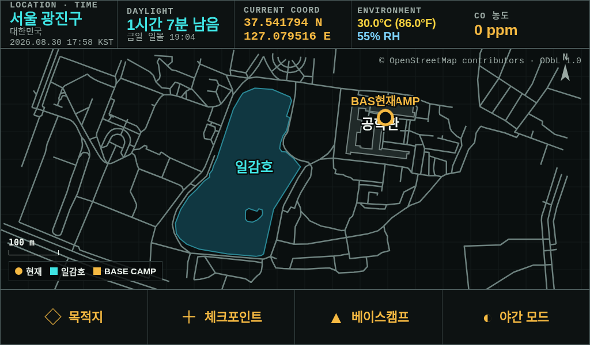

*7인치 1024×600 실기 화면. 상단 계기 스트립은 화면을 켠 순간 1초 안에 읽히도록 고정돼 있습니다.*

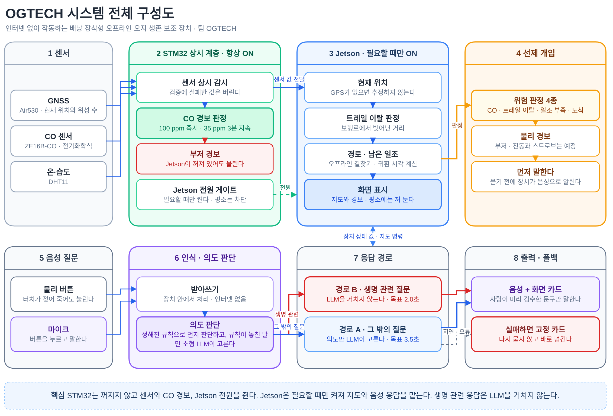

*센서 입력부터 음성 응답까지 8개 블록. 아래 목록과 같은 번호를 씁니다.*

<br>

1. **센서** — Air530 GNSS·ZE16B-CO·DHT11이 위치와 환경을 상시 내보낸다.
2. **STM32 상시 계층** — 항상 켜져 있다. 검증에 실패한 값은 버리고, CO는 100 ppm에서 즉시·35 ppm이 3분 지속되면 경보한다. **Jetson이 꺼져 있어도** 판정은 계속되고 경보는 해제 조건 전까지 유지된다(latched). 경보음은 Jetson 스피커가 낸다. Jetson 전원은 MOSFET 게이트로 필요할 때만 넣는다.
3. **Jetson 지도 엔진** — 필요할 때만 켜져 현재 위치·트레일 이탈·경로·남은 일조를 전부 로컬에서 계산한다. **GPS가 없으면 추정하지 않는다.** 화면은 평소에 꺼 둔다.
4. **선제 개입** — CO 상승·트레일 이탈·일조 부족·도착 네 가지를 장치가 **먼저** 판정해 경보음과 음성으로 알린다. (진동·스트로브는 적용 예정)
5. **음성 질문** — 물리 버튼을 누르고 말한다. 터치가 젖어 죽어도 버튼은 살아 있다.
6. **인식 · 의도 판단** — whisper.cpp가 장치 안에서 받아쓰고, 정해진 규칙이 먼저 판단한다. 규칙이 놓친 말만 Qwen2.5 1.5B가 라벨과 지도 동작 **enum 2개**를 고른다.
7. **응답 경로** — 생명 관련 질문은 **LLM을 거치지 않고** 검수된 고정 카드로 간다. (경로 B, 목표 2.0초) 그 밖의 질문만 의도 판단을 거친다. (경로 A, 목표 3.5초)
8. **출력 · 폴백** — 사람이 미리 검수한 문구를 음성과 화면 카드로 낸다. 지연·오류에는 **다시 묻지 않고** 고정 카드로 넘긴다.

> 부팅 시 **"이 장치는 구조 요청 수단이 아니다"** 라는 한계 고지를 건너뛸 수 없게 1회 표시합니다.

## 👀 Main feature

- ### 1️⃣ 오프라인 지도와 위치 로그 역추적

  사전 반입한 지도 데이터(GraphML / OSM XML)를 Jetson 안에서 변환해 Canvas 2D로 직접 렌더링합니다.
  네트워크·타일 서버·외부 SDK가 전혀 없어야 성립하는 요구사항이라 지도 엔진을 자체 구현했습니다.
  **방위·거리·경로는 전부 코드가 계산합니다. LLM은 이 값을 만들지 않고 읽어 주기만 합니다.**

  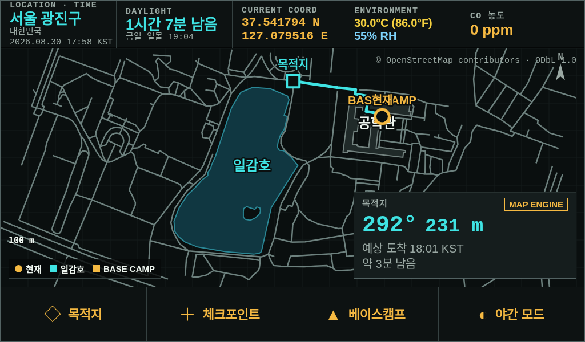

  *목적지를 지정하면 보행로 그래프 위에서 경로를 계산합니다. `292° 231 m`는 코드가 계산한 값이며
  `MAP ENGINE` 배지로 출처를 화면에 명시합니다. 직선거리가 아니라 보행로를 따라간 거리입니다.*

  <br>
  <details>
    <summary>지도 · 항법 module 상세설명 ⏬</summary>

  - **map_engine**: GraphML/OSM XML 파싱, 보행로 그래프 구성, 뷰포트 타일 캐시 상한 관리.
  - **gps_service**: Air530 NMEA 파싱, fix 여부·위성 수·정확도 관리. **미수신은 추정으로 덮지 않고 회색으로 유지.**
  - **navigation_service**: 트레일 이탈 거리 판정, 복귀 방위·거리 산출, 다음 웨이포인트 안내.
  - **position_history**: 이동 경로 자동 기록, "3분 전 지점까지 방위 210°, 40 m" 형식의 역추적 응답 생성.
  - **경로 계산**: NetworkX 기반 최단 경로. 외부 라우팅 API를 호출하지 않습니다.
  </details>

- ### 2️⃣ 남은 일조 시간 카운트다운

  위도·경도·날짜만으로 일출·일몰·시민박명을 **오프라인 천문 계산**으로 구합니다.
  최근 보행 속도와 복귀 거리를 비교해 되돌아설 시점을 역산하고, 여유가 부족해지면 적색 경고와 음성으로 개입합니다.

  

  *사용자가 묻지 않았는데 장치가 먼저 개입하는 장면입니다. 남은 일조 시간과 복귀 소요 시간을 비교해
  임계에 닿으면 적색 배너와 음성이 나가고, 동시에 복귀 경로 `112° 231 m`를 계산해 보여 줍니다.*

  <br>
  <details>
    <summary>일조 시간 계산 상세설명 ⏬</summary>

  - **solar_service**: 태양 적위·시간각 계산 → 일출 / 일몰 / 시민박명 종료 시각. 통신·API 없이 성립합니다.
  - **잔여 시간 산출**: `civil_end - now`를 분 단위로 유지하고 상단 계기 스트립에 상시 노출합니다.
  - **회귀 판단**: 최근 이동 속도 × 복귀 거리로 소요 시간을 추정해 잔여 일조와 비교합니다.
  - **색 규율**: 여유 충분은 시안(계측 판독값), 임계 도달은 적색(즉시 행동). 앰버는 `추정` 값에만 씁니다.
  - **LLM 미관여**: 이 경로에 모델은 전혀 개입하지 않습니다.
  </details>

- ### 3️⃣ 취침 중 일산화탄소 감시와 이중 전원 계층

  밀폐된 텐트 안의 연소기구는 **수면 중에 초기 증상을 자각할 수 없다**는 점이 가장 위험합니다.
  그래서 감시 주체를 Jetson이 아니라 STM32로 내렸습니다.
  전기화학식 CO 센서를 상시 계층에 직결해, **Jetson 전원이 꺼져 있어도** STM32가 판정을 계속하고
  경보를 해제 조건 전까지 유지합니다. **판정은 Jetson 부팅을 기다리지 않습니다.**
  경보음과 음성 안내는 Jetson 스피커가 냅니다(2026-08-31 부저 출력 제거) — 전원이 꺼져 있는 동안에는
  판정만 유지되고, 전원이 들어오는 즉시 울립니다. 전원 차단 중 자동 기상은 미구현입니다.
  (진동 모터·고휘도 스트로브는 적용 예정입니다.)

  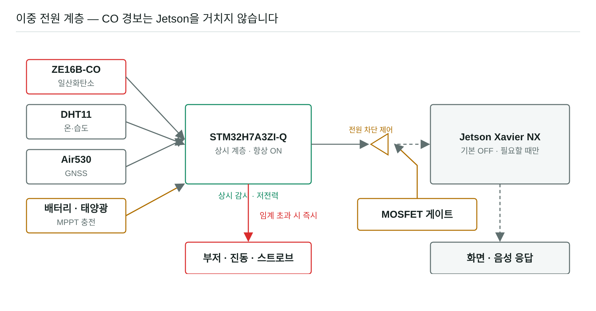

  *CO 경보 경로는 Jetson을 거치지 않습니다. 부팅을 기다리지 않고 상시 계층이 직접 울립니다.*

  <br>
  <details>
    <summary>전력 상태(State Machine) 상세설명 ⏬</summary>

  - **S1 / 감시 (0.35 W)**
    STM32 단독. CO·온습도·기압 폴링, GNSS 로깅, Jetson 전원 차단(MOSFET OFF). 기본 상태입니다.
  - **S2 / 항법 (0.55 W)**
    이동 감지 시 GNSS 샘플링 주기를 올려 트레일 이탈을 판정합니다. 화면은 여전히 OFF.
  - **S3 / 표시 (13 W)**
    사용자가 화면을 켠 구간. Jetson 전원 인가 → Chromium 키오스크 → 글랜서블 4개 표시.
  - **S4 / 응답 (18 W)**
    음성 질의 처리 구간. STT → 안전 분기 → (필요할 때만) LLM → TTS. 응답 후 즉시 S1/S2로 복귀합니다.
  - **경보 인터록**
    CO 임계 초과는 어떤 상태에서도 최우선입니다. S1에서도 STM32가 Jetson을 깨우지 않고 즉시 판정해
    경보를 latched로 유지하며, 소리는 Jetson 스피커로 냅니다(전원이 꺼져 있으면 켜진 뒤에 울립니다).
  </details>

  <br>
  <details>
    <summary>센서 · 전원 구성 상세설명 ⏬</summary>

  - **CO**: 현재 ZE16B-CO 실장. ZE07-CO / ZE15-CO는 향후 적용 예정(현재 미연결)입니다. MQ 시리즈는 히터 소비전력이 상시 예산의 2배라 **채택하지 않습니다.**
  - **환경**: 현재 DHT11(온·습도) 실장. SHT40(온·습도) + BMP390(기압)은 향후 적용 예정(현재 미연결)이며, 기압 추세 기반 국지 기상 추정은 BMP390 적용 후 동작합니다.
  - **측위·시각**: Air530 GNSS(실장) + MMC5983MA(지자기) + IMU + DS3231 RTC — DS3231은 향후 적용 예정(현재 미연결)입니다.
  - **경보 출력**: 현재 Jetson USB 스피커(경보음 + 음성 안내). 보드 부저 출력은 2026-08-31 제거했습니다. IP67 사양과 진동 모터 · 고휘도 스트로브 · 물리 버튼 3개는 향후 적용 예정(현재 미실장)입니다.
  - **전원**: 4S Li-ion 21700(330 Wh) + 접이식 태양광 + BQ24650 MPPT.
  </details>

- ### 4️⃣ 제한된 LLM과 즉시 폴백

  LLM은 판단 주체가 아니라 **정해진 범위 안에서 텍스트만 다루는 부품**입니다.
  경로·방위·거리는 **출력 스키마에 숫자 필드 자체가 없어** 환각할 자리가 없습니다.
  생명 관련 질문은 모델에 도달하기 전에 키워드 게이트가 잡아 검수된 고정 카드로 보냅니다.

  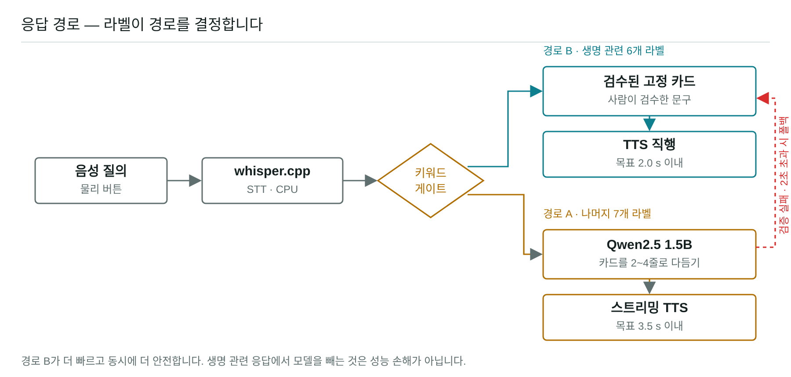

  *경로 B가 더 빠르고 동시에 더 안전합니다. 생명 관련 응답에서 모델을 빼는 것은 성능 손해가 아닙니다.*

  <br>
  <details>
    <summary>LLM 역할 3가지 상세설명 ⏬</summary>

  - **1)+2) 의도 판단** (`OGTECH-llm/harness/intent.py`, 2026-08-30): 규칙이 놓친 발화만 → `{scenario_id, action}` **enum 2개**.
    라벨 14개(`lost, route, daylight, weather, shelter, warmth, water, food, sleep_safety, injury, wildlife, gear, refuse, unknown`)
    × 지도 동작 14개(`save_basecamp, find_nearest_water, night_on …`)+`none`. 값이 아니라 **"무엇을 하라는지"만** 고르고,
    guard가 생명 라벨·비허용 동작·확인 대기 밖 `confirm`을 걸러 고정 카드로 내립니다.
  - **3) 카드 맞춤 문장**: 선택된 고정 카드 + 장치 상태 → 2~4줄, 약 96 토큰 상한. 구현은 있으나 **시연 프로필에서는 꺼 둡니다**(`polish.mode=off`).
  - **시연 대사는 LLM을 거치지 않습니다**: 대사 11턴·변형 66개는 STT 보정 사전 → 정본 규칙 → 시연 오버레이 규칙에서 확정(20회 동일).
    LLM은 규칙 밖 발화의 안전망이고, 타임아웃·오류·깨진 JSON은 재시도 없이 고정 카드입니다.
  - **생성 설정**: `temperature = 0`. 취향이 아니라 리허설 20회 동일 출력을 보장하기 위한 재현성 요구입니다.
  - **구조 강제**: JSON Schema 제약(llama.cpp GBNF). 문법 실패가 구조적으로 0이므로 **재시도 단계가 없습니다.**
  </details>

  <br>
  <details>
    <summary>응답 경로 2개 상세설명 ⏬</summary>

  ```text
  경로 B (LLM 우회, 목표 2.0 s 이내)
    lost / daylight / warmth / sleep_safety / injury / refuse
    → 키워드 게이트 → 검수된 고정 카드 → TTS 직행

  경로 A (LLM 다듬기, 목표 3.5 s 이내)
    route / weather / water / food / shelter / wildlife / gear
    → 분류 → 고정 카드 → LLM 2~4줄 → 문장 단위 스트리밍 TTS
  ```

  - **경로 B가 더 빠르고 동시에 더 안전합니다.** 생명 관련 응답에서 모델을 빼는 것은 성능 손해가 아닙니다.
  - **폴백**: 검증 실패 또는 2초 초과 시 재시도 없이 고정 화면으로 전환합니다.
  - **모호하면 키워드가 결정하지 않습니다.** 두 라벨이 동시에 잡히면 LLM 분류로 강등합니다.
    단, `refuse` 키워드가 있으면 다른 매칭을 무시하고 무조건 `refuse`입니다. (안전 편향)
  </details>

  <br>
  <details>
    <summary>STT(whisper.cpp) 실행 구성 상세설명 ⏬</summary>

  Jetson 통합 메모리 환경에서는 74M 파라미터 모델의 **커널 실행 오버헤드가 연산량을 압도**해 CPU가 유리합니다.
  반대로 1.5B LLM은 GPU가 유리합니다. 그래서 실행 타깃을 작업 크기별로 나눴습니다. (STT → CPU, LLM → GPU, TTS → CPU)

  - **`-ac 450`이 지연의 대부분을 설명합니다.** whisper는 입력이 5초여도 인코더를 30초 멜 윈도로 돌립니다.
    이 패딩 연산을 잘라 **7,720 ms → 1,494 ms** `[실측]`.
  - **`-ng`는 선택이 아니라 필수**입니다. 빼면 91 MiB cudaMalloc 실패로 SIGSEGV `[실측]`.
  - **beam search 기각**: 지연 +33%에 출력이 한 글자도 바뀌지 않았습니다 `[실측]`.
  - **판정은 중앙값이 아니라 최댓값**으로 봅니다. 데모 조건이 연속 20회라 한 번의 이상치가 곧 실패입니다.
  </details>
  <br>
  <details>
    <summary>음성 파이프라인(버튼 → STT → 의도 → TTS)과 Jetson 실측 상세설명 ⏬</summary>

  - **입력**: 물리 버튼(`physical_voice.py`) 또는 키오스크 → USB 마이크 녹음 → whisper.cpp(CPU) → STT 보정 사전(`stt_lexicon.json`).
  - **의도**: 정본 규칙(`keyword_rules.yaml`) → 시연 오버레이 → 규칙이 놓친 발화만 Qwen2.5-1.5B(Q4, llama-server GPU, JSON 스키마 강제) → guard.
    지도 명령 15종: `save_basecamp · save_checkpoint · route_basecamp · route_destination · route_last_checkpoint · route_recent_trace · clear_destination · find_nearest_water · confirm_destination · reject_destination · night_on · night_off · status · cancel · repeat_response`. 지도 명령은 MAP `/api/voice`로 전달되고 화면이 즉시 반영합니다.
  - **출력**: 검수된 고정 카드 → TTS. 엔진은 sherpa-onnx VITS 한국어 여성 음성(KSS, CPU 상주 캐시, 첫 소리 0.45 s, 발화 속도 0.9배)이며, 목적지 확정·도착·복귀·TTS 불가 안내 4종은 사전 렌더 WAV로 즉시 재생합니다. 음성 출력 실패 시에도 화면 카드는 남습니다.
  - **Jetson Xavier NX 실측(2026-08-30)**: 의도 라벨 정확도 280문장 중 241 = **86.1%**(규칙 미매칭 발화 전용, 게이트 90% 미달·계속 보정), refuse 모델 단독 인식 38/50, warm 응답 20회 최댓값 **0.751 s**(예산 2.0 s), 시연 대사 11턴·변형 66개 20회 동일, 오류 0. 수치는 `OGTECH-llm/results/`.
  </details>

- ### 5️⃣ 서버 및 디스플레이

  #### 1. 서버 (Python, 표준 라이브러리)

  Jetson에 네트워크가 없으므로 **외부 프레임워크·CDN·런타임 의존을 두지 않았습니다.**
  Jetson에서는 MAP 서버 `8790` 하나가 지도·장치·음성 API와 키오스크 화면을 함께 서빙하고, Firefox `--kiosk`가 `http://127.0.0.1:8790/select/` 단일 창으로 떠서 제품 화면(`/product/`)과 촬영 화면(`/video/`)을 터치로 고릅니다.
  규칙 엔진 backend `8765`는 독립 서비스로도 실행되며, Jetson 시연 구성에서는 같은 규칙(`ogtech_core`)을 Co-LLM이 in-process로 씁니다.

  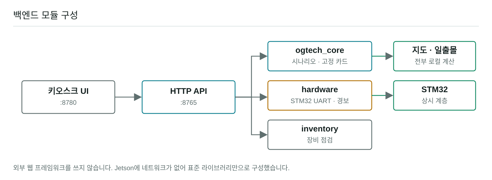

  <br>
  <details>
    <summary>백엔드 module 상세설명 ⏬</summary>

  - **backend `:8765` — ogtech_core (규칙 라우터 · 카드 렌더러)**: 14라벨 키워드 게이트, refuse 최우선, 생명 라벨은 LLM 판단을 채택하지 않고 검수 고정 카드로 직행. 정본은 OGTECH-llm `Co-LLM/scripts/ogtech_core.py`이며 backend는 바이트 일치가 테스트로 강제되는 사본을 서비스합니다. **LLM 호출 없음.**
  - **backend API(Handler)**: `ThreadingHTTPServer` 기반 `POST /api/classify` · `POST /api/respond` · `GET /api/card/<id>`. 모든 오류는 JSON으로 응답합니다.
  - **frontend MAP `:8790` — map_engine / gps_service / navigation_service / solar_service / position_history**: 지도·GPS·트레일 이탈·복귀 방위·일출몰·위치 역추적. **전부 로컬 계산이며 네트워크를 타지 않습니다.**
  - **frontend MAP `jetson/power_control`**: STM32 전원 게이트와의 연동 자리. 펌웨어·Jetson 파서는 JSONL+CRC16 프로토콜 v1로 통일 완료(호스트 연동 테스트 통과, 실장 검증 대기). 전원 버튼 handshake는 버튼 하드웨어가 없어 아직 성립하지 않음.
  </details>

  #### 2. Device UI (Web)

  | | |
  |---|---|
  | 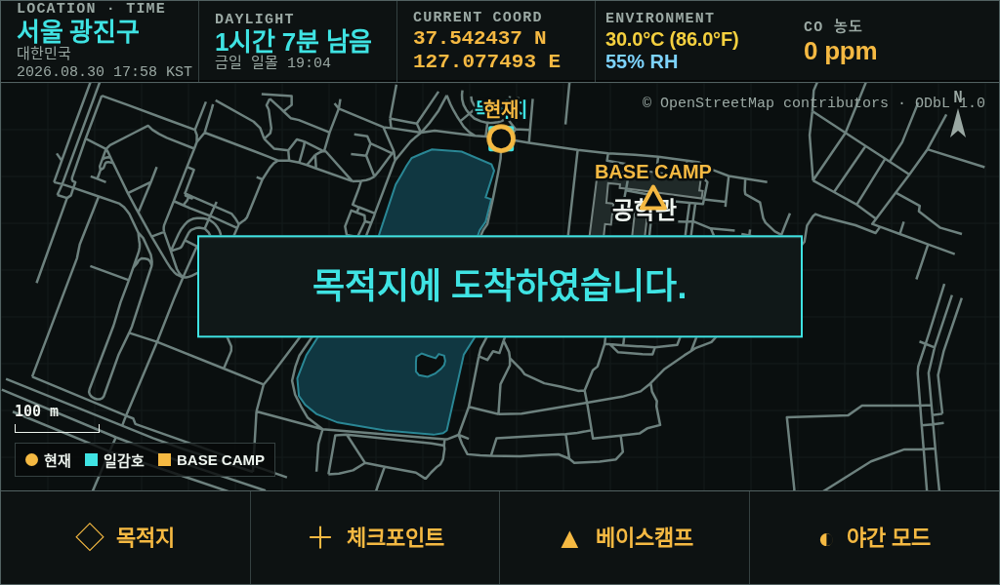<br>**목적지 도착** — 안내 카드와 음성 | 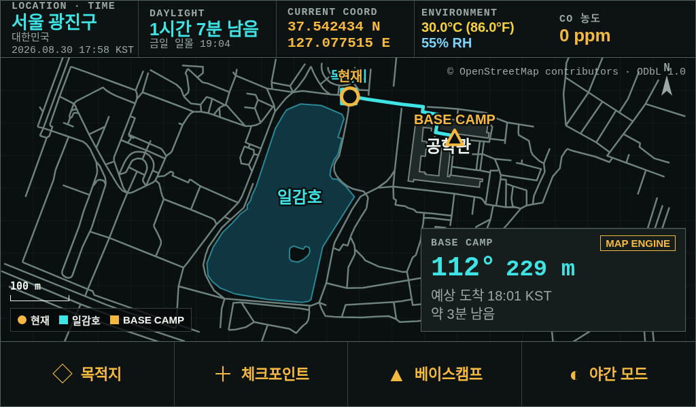<br>**복귀 경로** — 역방향 재계산 |
  | 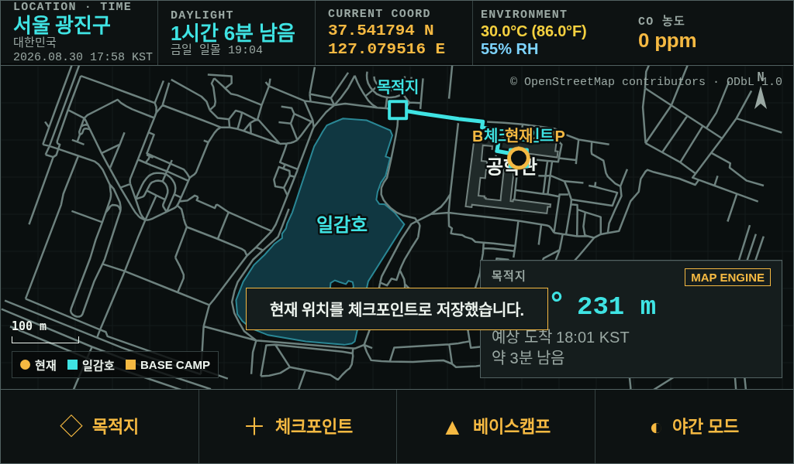<br>**체크포인트 저장** — 물리 버튼으로도 동작 | 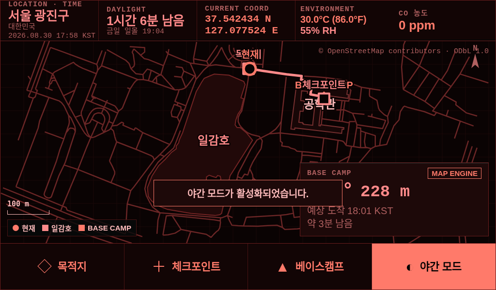<br>**야간 모드** — 적색 단색, 암순응 보호 |

  <br>
  <details>
    <summary>UI 규칙 상세설명 ⏬</summary>

  1024×600을 7인치에 넣으면 **169.5 PPI, 1 mm = 6.675 px**입니다. 이 화면에서 px는 거짓말을 합니다.

  - **터치 타깃 바닥은 80 px (12.0 mm)**. 흔히 쓰는 56 px는 8.4 mm라 장갑 조작 기준에 미달입니다.
  - **본문 텍스트는 20 px (3.0 mm)** 아래로 내리지 않습니다.
  - **화면은 기본 OFF**입니다. 전력 예산 때문이며, 음성이 1차 출력이고 화면은 2차입니다.
  - **글랜서블 5개**: 화면을 켠 순간 1초 안에 읽혀야 합니다 —
    `현재 좌표 상태` / `남은 일조 시간` / `배터리 잔여 일수` / `트레일 이탈 여부` / `환경(STM32 온·습도·CO 실측)`.
  - **야간 모드는 적색 단색**. 백색광은 암순응을 파괴하고 전력도 더 씁니다.
  - **물리 버튼 3개 필수**: 전원 / 체크포인트 저장 / 음성 질문. 터치가 죽어도 P0는 살아야 합니다.
  </details>

  <br>
  <details>
    <summary>색 규율 상세설명 ⏬</summary>

  | 색 | 의미 | 사용처 |
  | --- | --- | --- |
  | 적색 | 경고 — 즉시 행동 | CO 경보, 일조 시간 부족, 하드 실패 |
  | 앰버 | 주의 — 미검증·성능저하 | 모의 데이터 배지, **기상 추정값**, 대기열 |
  | 녹색 | **실제 센서로 확인됨** | GPS fix, LIVE 계측, 검수 배지 |
  | 시안 | 계측 판독값 | 시각, 좌표, 거리, 카운트 |
  | 회색 | **데이터 없음** | GPS 미수신, 경로 데이터 없음 |

  **회색이 녹색을 빌려 쓰면 안 됩니다.** "모름"이 "정상"처럼 보이는 순간 이 작품의 전제가 무너집니다.
  </details>

- ### 6️⃣ 전원 인가 즉시 기동 · 실기기 화면

  네트워크 없는 현장에서 사람이 터미널을 열 수 없으므로, Jetson은 **전원만 넣으면** 지도 서버 → 키오스크 → LLM 서버(워밍업 포함) → 물리 음성 → 장치 감시 5개 서비스가 사용자 systemd 유닛으로 자동 기동합니다(`loginctl enable-linger`). 부팅 완료까지 약 75 s, 재부팅 3회 연속 검증 `[실측 2026-08-30]`.

  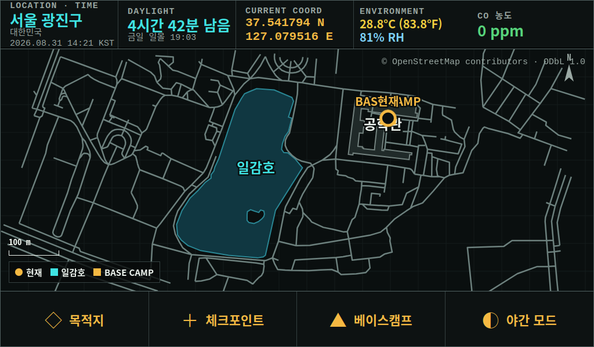

  *Jetson Xavier NX 실기기 화면 캡처(2026-08-31 14:21, `/video/?live=1` — 키오스크가 띄우고 있던 화면 그대로). 촬영 화면과 제품 화면(`/product/`)은 같은 마크업·CSS·그리기 코드를 쓰고 데이터 소스만 다릅니다. ENVIRONMENT 칸의 28.8 ℃ · RH 81 %와 CO 0 ppm은 STM32가 40핀 UART(`$SA1`, 1 Hz)로 보낸 실측값입니다(`?live=1`이 온·습도·CO만 실값으로 채웁니다). 이 화면의 좌표·경로·일조는 시나리오 고정값이고, 실측 GPS를 쓰는 `/product/`에서는 실내라 위성이 안 잡히면 추정으로 덮지 않고 `좌표 없음 · GPS 미수신`으로 남습니다 — **없는 값을 있는 것처럼 만들지 않는 것이 이 화면의 규칙입니다.***

  <br>
  <details>
    <summary>기동 순서 · 자가 복구 상세설명 ⏬</summary>

  - **ogtech-map**(`:8790`) → **ogtech-kiosk**(Firefox `--kiosk`, 전용 프로필이라 정전 뒤 "세션 복구" 대화상자가 뜨지 않음, MAP 응답을 기다린 뒤 실행) → **ogtech-llm-server**(llama-server 기동 → `/health` → `ExecStartPost` 워밍업으로 프리픽스 KV 캐시 적재, cold 0.748 s → warm 0.751 s) → **ogtech-physical-voice** · **ogtech-device-monitor**.
  - 오디오는 PulseAudio 기본 장치를 USB 마이크·스피커로 고정해 재부팅 뒤에도 유지됩니다.
  - `/api/diagnostics`가 지도 · POI · RTC · GPS · 센서 · 음성 파일 6항목을 검사해 `ready / demo / waiting / degraded`를 돌려줍니다.
  - 각 유닛은 `Restart=on-failure`이며, STM32 UART를 점유하던 JetPack 기본 `nvgetty`는 비활성화했습니다(부팅 뒤 STM32 리셋 없이 즉시 `connected:true`).
  </details>

## Environment

### Embedded


### Backend


### Frontend


### LLM / Voice


## 🗂 Architecture

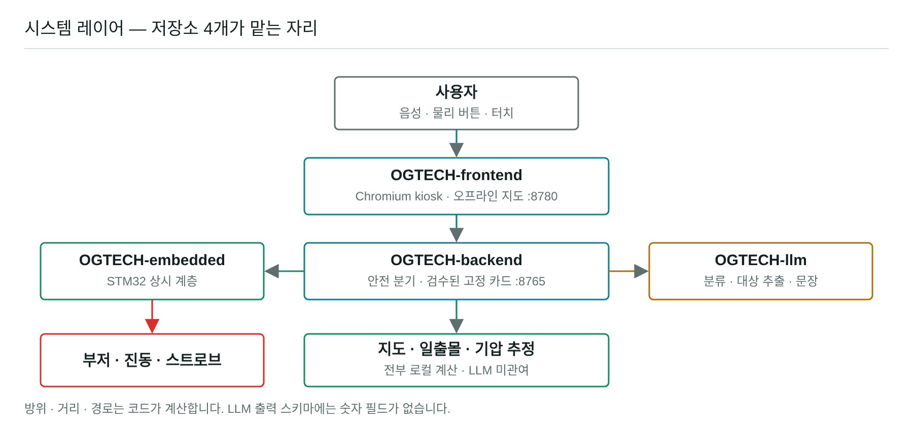

```text
사용자 (음성 · 물리 버튼 · 터치)
│
├─ OGTECH-embedded/                    STM32H7A3 센서 허브
│  ├─ Core/Src/main.c                  보드 초기화 · 메인 루프
│  ├─ Core/Src/sensor_hub.c            GPS · DHT11 · CO 수집
│  └─ Core/Src/jetson_link.c           $SA1 프레임 · XOR · UART4 전송
│           │
│           └─ UART4 115200
│                │
├─ OGTECH-frontend/MAP/                Jetson 지도 · 장치 서버 :8790
│  ├─ app.py                           HTTP 서버 · 제품 API
│  ├─ gps_service.py                   STM32 · NMEA 수신
│  ├─ map_engine.py                    GraphML · OSM 지도와 경로 계산
│  ├─ navigation_service.py            목적지 · 복귀 · 이탈 판단
│  └─ kiosk/                           7인치 지도 UI
│
├─ OGTECH-backend/                     로컬 규칙 서버 :8765
│  ├─ app.py                           classify · respond · card API
│  ├─ core/ogtech_core.py              키워드 분류 · 카드 생성
│  ├─ config/keyword_rules.yaml        분류 규칙
│  └─ config/survival_cards.json       응답 카드
│
└─ OGTECH-llm/                         로컬 AI · 음성
   ├─ harness/intent.py                사용자 의도 · 지도 동작 추출
   ├─ harness/guard.py                 AI 출력 검사
   ├─ runner/start_llama_server.sh     로컬 모델 서버 시작
   └─ Co-LLM/scripts/
      ├─ product_assistant.py          규칙 · AI · 지도 연결
      ├─ wake_voice.py                 호출어 · 음성 명령 처리
      └─ tts_pipeline.py               음성 합성 · 재생
```

저장소의 전체 파일은 [FILE_STRUCTURE.md](FILE_STRUCTURE.md)에 경로별로 정리했습니다.

## 📁 Repository Guide

이 저장소 하나에 STM32, Jetson 화면·지도, 백엔드, 음성·LLM 코드를 모두 모았습니다.

| 폴더 | 내용 | 먼저 볼 곳 |
| --- | --- | --- |
| [`OGTECH-embedded`](OGTECH-embedded/) | STM32 센서 수집과 Jetson 전송 | [`Core/Src/main.c`](OGTECH-embedded/Core/Src/main.c) · [`README.md`](OGTECH-embedded/README.md) |
| [`OGTECH-frontend`](OGTECH-frontend/) | Jetson 키오스크, 오프라인 지도, 항법, 장치 API | [`MAP/app.py`](OGTECH-frontend/MAP/app.py) · [`MAP/README.md`](OGTECH-frontend/MAP/README.md) |
| [`OGTECH-backend`](OGTECH-backend/) | 로컬 규칙 서버와 응답 카드 | [`app.py`](OGTECH-backend/app.py) · [`README.md`](OGTECH-backend/README.md) |
| [`OGTECH-llm`](OGTECH-llm/) | STT, 의도 분류, TTS | [`Co-LLM/README.md`](OGTECH-llm/Co-LLM/README.md) · [`results/`](OGTECH-llm/results/) |
| [`assets`](assets/) | 화면과 시스템 이미지 | [`01_basecamp_start.png`](assets/01_basecamp_start.png) |

<br>


## ⚠️ 안전 경계

**OGTECH은 구조 요청 수단이 아닙니다.** 조난 **예방**과 **자력 탈출**만 담당합니다.
사용자는 별도의 구조 요청 수단(휴대폰, PLB, 위성 통신기)을 반드시 함께 지참해야 하며,
이 한계는 부팅 시 화면에 표시되고 건너뛸 수 없습니다.

- 실족·추락은 예방하지 못합니다.
- 기상 표시는 예보가 아니라 기압 추세 기반 **국지 추정**이며 항상 `추정` 배지가 붙습니다.
- LLM은 경로·방위·거리·처치 절차를 생성하지 않습니다. 출력 스키마에 숫자 필드가 없습니다.
- 진단, 약물명·용량, 침습 처치, **야생 동식물의 식용 가능 여부**는 어떤 형태로도 판정하지 않습니다.
- GPS 미수신을 위치 추정으로 덮지 않습니다. 마지막 확정 좌표와 경과 시간만 표시합니다.


## 📄 제3자 라이선스

- 지도 데이터: © OpenStreetMap contributors, ODbL 1.0
- Qwen2.5 1.5B: Apache-2.0
- llama.cpp / whisper.cpp: MIT
- 프로젝트 자체 LICENSE와 추가 의존성 고지는 공개 전환 전 확정합니다.

## Team Member

<br>

| 팀원 | 역할 |
| ---- | ---- |
| **이준형(팀장)** | 기획 / 시스템 설계 / 로컬 AI / 음성 / UI |
| **최민혁** | HW 기구 설계 및 3D 모델링 / 배터리 시스템 |
| **이남권** | STM32 제어 / 센서 / 지도 / 길찾기 |
